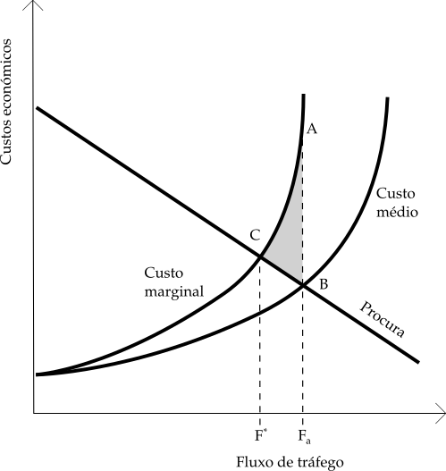

# A fundamentação das decisões públicas

\label{chap:fundpol}

Ao analisar a história da implementação das PPPR em particular e da disponibilização de autoestradas em geral na \autoref{chap:persphist}, é saliente uma precipitação e uma má fundamentação gerais nos processos de tomada de decisão sobre a construção dessas infraestruturas, gritantemente manifestadas em aspectos como:

- previsões de tráfego inverosímeis;
- opções injustificadas pelo "perfil de autoestrada";

nos quais as opções tomadas, há anos, pelo "perfil de autoestrada" surgem justificadas com previsões de tráfego que hoje sabemos estarem fora da realidade mas que, à data da decisão, não eram tão nitidamente inverosímeis como são hoje. 

Este processo de decisão é completamente opaco: apesar de os contratos das PPPR estarem hoje todos disponíveis online, os estudos de base que levaram às opções de construção firmadas nesses contratos são literalmente impossíveis de encontrar. O mesmo para as concessões de autoestrada de portagem real da Brisa, historicamente muito anterior ao desenho das PPPR. 

Sobram apenas alguns estudos, indicadores e meros comentários na comunicação social que surgem a público por razões paralelas como a polémica em torno do Novo Aeroporto de Lisboa (NAL) ou da preparação para a construção de vias eternamente adiadas como é o caso do IC4 na Costa Vicentina. Não se conseguiram encontrar publicadas nenhumas estimativas oficiais de custos por quilómetro de construção de rodovias, algo fundamental a ter em conta na decisão sobre o nível de serviço ou as características técnicas de uma ligação rodoviária a construir.

## Custos da opção pelo "perfil de autoestrada"

Para dar uma indicação de custos genéricos de construção por quilómetro, produz-se de seguida uma estimativa exploratória para um conjunto reduzido de empreendimentos rodoviários, assente apenas em valores extraídos da comunicação social. Para a atualização de preços a 2016 foi usado o calculador online baseado no Índice de Poder de Compra (IPC) do [INE](https://www.ine.pt/xportal/xmain?xpid=INE&xpgid=ipc) recorrendo às opções "Actualização de Valores com Base no IPC, entre anos" e "Índice de preços no consumidor exceto habitação (Média anual)". 

Os resultados dessa estimativa estão patentes na tabela \ref{tabcustokm}. Vemos que o custo por quilómetro de autoestrada, a preços de 2016, será certamente superior a 3 milhões de euros. Num estudo de 2011 para o INIR I.P. (extinto Instituto de Infraestruturas Rodoviárias cujas competências estão hoje no Instituto de Mobilidade e Transportes IMT) a empresa [Atkins](http://www.inir.pt/portal/LinkClick.aspx?fileticket=BgtP9KbyEg0%3D&tabid=178&mid=739&language=pt-PT) indica como custos de referência:

- para construção com características de "IC" ou via rápida: 1 milhão de euros por km;
- para construção com características de estrada nacional: 700 mil euros por km.

Os valores indicados são obviamente genéricos e indicativos. Atualizados para 2016 seriam genericamente idênticos: 1039 e 726 mil euros, respectivamente.

Não podemos esquecer na produção deste tipo de estimativas que estes custos, além dos custos de construção civil, incluem os custos de expropriação de terrenos, o que ajuda a explicar o altíssimo valor encontrado para o fecho do IC17/CRIL, que atravessa uma área densamente urbanizada em terrenos muito valorizados na capital do país, enquanto o lanço *Fortunhos – VP Aguiar* da A24, que atravessa paisagem com uma ocupação humana de baixa densidade, tem um valor comparativamente muito mais baixo.

\begin{center}
\begin{threeparttable}[h]
\centering
\caption{Custos unitários de construção por comprimento, para autoestradas recentes em Portugal}
\label{tabcustokm}

\begin{tabular}{|lrcrrr|}
\hline
Obra                                      & \begin{tabular}[c]{@{}l@{}}Custo \\ construção \\ (CC milhão €)\end{tabular} & Ano* & \begin{tabular}[c]{@{}l@{}}CC atual. \\ a 2016 \\ (milhão €)\end{tabular} & \begin{tabular}[c]{@{}l@{}}Comprim. \\ (km)\end{tabular} & \begin{tabular}[c]{@{}l@{}}Milhões \\ €/km\end{tabular} \\ \hline
Ponte Vasco da Gama +  acessos            & 897                                                                          & 1998 & 1287                                                                       & 17,19                                                    & 74,89                                                   \\
A36 – IC17/CRIL – Pina Manique – Pontinha & 114                                                                          & 2011 & 118                                                                        & 4                                                        & 29,5                                                    \\
A10 – Ponte da Lezíria                    & 218                                                                          & 2007 & 241                                                                        & 11,46                                                    & 21,03                                                   \\
A7 – Guimarães – VPAguiar                 & 311                                                                          & 2005 & 363                                                                        & 41                                                       & 8,85                                                    \\
A17 – Mira – Marinha Grande               & 575                                                                          & 2008 & 621                                                                        & 92,7                                                     & 6,7                                                     \\
A16 – IC16 CREL – Lourel                  & 68                                                                           & 2009 & 74                                                                         & 11,5                                                     & 6,43                                                    \\
A16 – IC30 Lourel - Alcabideche           & 59,5                                                                         & 2009 & 65                                                                         & 11                                                       & 5,91                                                    \\
A24 – Vila Real IP4 – Fortunhos           & 19                                                                           & 2006 & 22                                                                         & 6,5                                                      & 3,38                                                    \\
A24 – Vila Real Fortunhos – VP Aguiar     & 54                                                                           & 2007 & 60                                                                         & 19,8                                                     & 3,03                                                    \\ \hline
\end{tabular}

\begin{tablenotes}\footnotesize
    \item [*] Ano de entrada ao serviço
    \item Fonte: elaboração própria
 \end{tablenotes}
 
\end{threeparttable}

\end{center}

Vemos assim, que a opção pelo perfil de autoestrada em detrimento de um perfil alternativo de via rápida, seguindo o já referido critério de valor de TMDA 10000 veículos / dia, nos troços que não cumprem esse critério representa uma despesa de construção, no mínimo, três vezes superior ao que seria necessário. Como já foi atrás explicado, esta condição de volume de tráfego é encontrada em vários troços na nossa atual rede de autoestradas.

Este é um aspecto muito crítico da tomada de decisão sobre desenvolvimentos da rede de infraestruturas rodoviária. Uma decisão errada a este nível lança o país num claro desperdício financeiro que começa num investimento inicial desnecessariamente alto, com impacto nos pagamentos a efectuar por uma geração de portugueses. Talvez a necessidade do pagamento generalizado de portagens pudesse ter sido contornada também se, a este nível, tivesse havido uma ponderação mais cuidada.

Contudo esta opção relativa ao "perfil" escolhido terá, em muitos casos, assentado em previsões de tráfego as quais, supostamente, terão fornecido argumentos decisivos em favor das decisões assim tomadas.

## As justificações providenciadas pelos "estudos de tráfego"

Podemos melhor ilustrar as questões em volta dos estudos de tráfego obrigatórios nas tomadas de decisão sobre novas infraestruturas inseridas no Plano Rodoviário Nacional com um exemplo prático.

Vejamos o caso de uma das infraestruturas mais caras em proporção ao respectivo comprimento: a Ponte da Lezíria. 

Esta infraestrutura, parte da autoestrada A10 Arruda dos Vinhos - Benavente foi lançada com dois argumentos principais:

- facilitar as viagens do Norte do país para o Algarve, evitando o atravessamento da cidade de Lisboa;
- ser parte dos acessos ao futuro aeroporto (NAL) a localizar na Ota.

Esta obra arrancou muito antes de qualquer outra das infraestruturas de apoio ao NAL e ficou pronta em 2007, ironicamente num momento em que a localização do NAL começou a ser publicamente posta em causa.

Num [estudo](http://www.civil.ist.utl.pt/~mlopes/conteudos/TTT/NAL_CIP_RelatorioFinal_acessibilidades%20e%20transportes%20Out07.pdf) que hoje se encontra disponível online, uma empresa de consultoria especializada em mobilidade, produziu em 2007 um conjunto de previsões de volume de tráfego para esta via. 
Estas previsões cobriam um conjunto de cenários, quer de localização do NAL quer de suspensão da obra com manutenção do atual aeroporto de Lisboa na Portela de Sacavém. A previsão de tráfego de valor mais baixo era de cerca de 13000 veículos/dia TMDA. Noutros cenários previam-se quase 30000 veículos/dia TMDA. 

Num cenário coincidente com a situação atual, sem NAL e sem novas travessias do Tejo, para o ano de 2032, previam-se 13624 veículos/dia TMDA. 

Do ponto de vista destes resultados, próximos de 30000 veículos/dia, supondo que poderia ainda haver crescimento no futuro, a opção pelo perfil existente de 2x3 vias estaria adequada. 

Duas questões críticas se levantam todavia:

- passados dez anos o tráfego verificado é muito inferior a 13000 [^fnTrafegoRecente] -- é mesmo inferior a 6000 veículos/dia TMDA, marcadamente abaixo da justificação técnica para a construção de uma autoestrada;
- entre, por exemplo, 2009 e 2017 o volume de tráfego manteve-se praticamente inalterado; no entanto, teria de subir sustentadamente entre 400 e 500 veículos todos os anos até 2032 para a atingir os previstos 13000 veículos / dia;
- a zona atravessada é ambientalmente muito sensível pelo que se optou por uma construção toda em viaduto, atingindo o altíssimo custo médio de 29 milhões de euros por quilómetro (Tabela \ref{tabcustokm}).

[^fnTrafegoRecente]: A fonte para os valores de tráfego mais recentes (2º trimestre de 2017) está nos Relatórios de Tráfego na Rede Nacional de Auto-estradas do ex-INIR I.P. disponíveis no [sítio do IMT I.P.](http://www.imt-ip.pt/sites/IMTT/Portugues/InfraestruturasRodoviarias/RedeRodoviaria/Paginas/Relatorios.aspx)

Para o reduzido baixo tráfego certamente concorrerá também a imposição de uma taxa de portagem de cerca de €1,5, apesar de, aproximadamente, estar em linha com a aplicação da tarifa legal de referência com o valor de €0,098/km.

A opção tomada e as projecções de tráfego são ainda mais incompreensíveis se repararmos que esta obra entra em concorrência directa com outras três travessias do Tejo, duas das quais sem portagem:

- a ponte Salgueiro Maia em Santarém (sem portagem, mais a norte);
- a ponte Marechal Carmona da EN10 (sem portagem, muito próxima a sul);
- a ponte Vasco da Gama (mais a sul, com portagem mais cara).

Dada a coincidência dos valores de tráfego indicados e das opções de perfil tomadas, uma vez que as 2x3 faixas existentes são compatíveis com uma previsão superior 30000 veículos/dia TMDA, é provável que os valores do estudo de tráfego original, que terá justificado a decisão em favor da construção desta obra, seriam idênticos aos do estudo atrás referido.

Analisando esse estudo e recorrendo a valores recentes para alguns dos indicadores quantitativos usados como base nas previsões efectuadas, podemos identificar diversas assunções erradas:

- A existência de uma correlação forte entre PIB, consumo de combustível e volume de tráfego geral

	A realidade atual nega esta possibilidade: o PIB português caiu fortemente de 175 mil milhões de euros de 2007 [^fnPrecConst] (ano do referido estudo) para menos cerca de 170 mil milhões em 2013, tendo vindo a crescer paulatinamente desde então, tendo ultrapassado os 185 mil milhões de euros em 2016 ([PORDATA: Evolução do PIB](https://www.pordata.pt/Portugal/PIB+(base+2011)-130). Apesar disso, o consumo de combustíveis diminuiu ligeiramente, por exemplo, no gasóleo rodoviário de 4860 kt em 2017 para 4780 kt em Agosto de 2017 ([PORDATA - Venda de combustíveis](http://www.pordata.pt/Portugal/Venda+de+combust%c3%adveis+para+consumo-1131), Estatísticas rápidas Agosto de 2017 da [Direcção Geral de Energia e Geologia](http://www.dgeg.gov.pt/)).
	
	Com o advento dos veículos eléctricos e as perspectivas de crescimento do transporte ferroviário, decorrentes exactamente da necessidade do cumprimento das metas de redução de gases com efeitos de estufa com as quais o país se comprometeu no âmbito de protocolos e acordos internacionais, o próprio consumo de combustível deverá passar a ser um estimador cada vez menos eficaz do tráfego rodoviário em geral. 
	
- O crescimento contínuo da taxa de motorização

	A taxa de motorização também é outro indicador em estabilização há alguns anos: o número de veículos em circulação no país parece estar a estabilizar abaixo dos 5 milhões de veículos ligeiros, em linha com as possibilidade de estarmos a assistir a uma estagnação do crescimento populacional ou mesmo uma diminuição de população a médio prazo. [@anselmo] [^fnDemogr]. Apostar, em projecções a trinta anos, numa subida permanente da motorização do país, perante o que sabemos hoje, não é minimamente realista.

[^fnPrecConst]: Preços constantes, ano de referência 2011

[^fnDemogr]: O "cenário central* proposto em @anselmo indica uma população em 2040 inferior a 10 milhões, inferior ao valor de 10,56 milhões dos Censos 2011 do Instituto Nacional de Estatística (INE)
	
Perante estas duas fortes influências, a ideia peregrina que a procura de viagens na rede rodoviária deverá continuar a crescer nos próximos anos é errada e profundamente enganadora. Perante estas condicionantes, o aumento de tráfego numa determinada área do país, a existir, deverá dever-se quase exclusivamente a fenómenos de geração de tráfego ou de atractividade de âmbito meramente local.

Dado o fenómeno recente do crescimento da procura do nosso país por elevado número de turistas [^fnTuristas], poderão surgir impactos de crescimento de procura, decorrentes deste fenómeno, em locais com potencial atractividade turística ainda por explorar.

[^fnTuristas]: Segundo os dados mais recentes disponibilizados pelo Instituto Nacional de Estatística (INE), vários indicadores do turismo demonstram tendência de subida. 
Por exemplo, o *Dormidas (N.º) nos estabelecimentos hoteleiros* para todo o país mostra uma subida de 8% de 2014 para 2015 e de 11% de 2015 para 2016.

# A infraestrutura rodoviária como bem público

Ao promover a construção de uma autoestrada está o governo de um país a prover um bem público ao conjunto dos seus cidadãos? A teoria económica define duas propriedades que são fundamentais na definição e entendimento do que é um bem público [@mateus_mateus]:

- **não-exclusão**: o bem público não pode ser excluído a um indivíduo que não o pague, ao contrário do bem privado, cujo consumo é exclusivo de quem se dispõe a pagar o respectivo preço

- **não-rivalidade** (ou *não-exaustão*): o consumo do bem por um indivíduo não evita ou diminui o consumo do mesmo bem por outra pessoa

Um indivíduo não pode ser excluído do acesso a um bem público como a defesa ou a mitigação dos efeitos de uma catástrofe natural por não pagar um determinado preço, por isso falamos de *não-exclusão* neste tipo de bens. De igual forma a *não-exaustão* também se aplica: em princípio e em condições ditas "normais", diriamos que mais um carro a passar numa infraestrutura não impediria a passagem de outros carros.

Será mesmo assim? No caso das infraestruturas rodoviárias a *não-rivalidade* depende do estado de congestão do tráfego que a atravessa. Se o grau de congestão for elevado, um número elevado de veículos que se encontram a "consumir" o bem infraestrutura, atravessando-o, vão colocando entraves ao consumo por outros veículos adicionais, de forma crescente até se formar um engarrafamento e o fluxo de tráfego parar por bons minutos ou horas, durante as quais a velocidade efetiva de deslocação pode ser inferior ao andar a pé. Neste caso, o bem não estará efetivamente a ser consumido, uma vez que cada consumidor não consegue realmente tirar o benefício esperado: deslocar-se.

O tema desta dissertação envolve autoestradas sujeitas a pagamento de portagem. O pagamento de uma taxa de portagem corresponde ao pagamento de um preço pelo atravessamento da infraestrutura, pelo seu "consumo".

Então, sendo assim, a estrada portajada poderá ser efetivamente um bem *rival* e um bem *exclusivo*: bem exclusivo uma vez que o preço cobrado na forma de portagem pode excluir número significativo indivíduos da sua utilização e, nos casos em que exista congestão, o consumo do bem por mais um individuo contribuí para que menos individuos encontrem o bem disponível para uma utilização consentêanea com a expectativa de realizar uma viagem rápida. 

Porquê então continuarmos a dizer que é um bem público? Porque circunstâncias específicas levam a que deva ser provido pelo Estado, mesmo que nesse provimento estejam envolvidas entidades privadas.

Qual o real papel das empresas privadas nos empreendimentos PPPR? Na verdade, estas empresas são apenas concessionários: durante um período de 20 ou 30 anos, as empresas envolvidas prestam um leque de serviços, que inclui adiantar ao Estado, a troco de juros, a enorme soma de dinheiro do investimento inicial, necessária à construção e equipamento da infraestrutura de forma a que possa ser vir a ser posta ao serviço dos condutores e seus veículos. Mais tarde, com a obra concluída, prestam serviços de manutenção: assistência em viagem em caso de avaria, avisos à circulação, limpeza, reparações de pavimento e sinalização, etc.

No final da concessão tudo o que foi construído reverte para o Estado. Algo muito importante e essencial em tudo isto: os terrenos sobre os quais a infraestrutura foi construída, são expropriados pelo concessionário em nome do Estado, sendo-lhes permitido recorrer aos mecanismos de expropriação que o próprio Estado possuí para retirar a posse de terrenos privados aos respectivos proprietários, em nome do superior interesse público. Existem assim disposições legais que asseguram ao Estado a possibilidade de este tomar posse de todas as terras privadas necessárias à construção de uma infraestrutura, desde que compense os antigos proprietários por um valor justo definido de forma arbitral, fora de regras de mercado [@expropriacao]. Os contratos de concessão dão a possibilidade ao concessionário de se substituir ao Estado neste processo de expropriação.

A posse das parcelas de terreno que suportam a infraestrutura é do Estado [^fnExprBrisa] ou, no máximo, reverterá para o Estado no fim dos contratos. Esta é uma garantia básica que a globalidade da infraestrutura construída é, no essencial, pública, independentemente de quaisquer outros arranjos e negociações com privados que possam ser postas em prática para que tudo esteja pronto a ser disponibilizado ao público consumidor.

[^fnExprBrisa]: Para o caso da concessão BRISA, consultar o [Decreto-Lei n.º 294/97](http://data.dre.pt/eli/dec-lei/294/1997/10/24/p/dre/pt/html) - Anexo Base IV "Natureza dos bens que integram a concessão"

É absolutamente impensável a existência, no futuro, de um provimento totalmente privado de autoestradas quer porque a aquisição de terrenos de acordo com as regras de mercado, fora de processos de expropriação, levaria a investimentos iniciais ainda mais elevados quer porque a natural exiguidade dos corredores de território disponível levaria à impossibilidade do surgimento de infraestruturas concorrentes.

## O monopólio "natural" do provimento de infraestrutura rodoviária

Como referido por -@mateus_mateus, as economias modernas são economias mistas constituídas por uma mistura entre sector privado e sector público, não existindo um consenso sobre a linha divisória de separação entre ambos.

Este é, ainda hoje, o domínio de um intenso debate político no qual os defensores de uma maior prevalência do Estado alinham com as chamadas tendências ideológicas de esquerda, enquanto que a "direita" defende a prevalência do sector privado. É hoje impensável pensar numa economia exclusivamente de sector privado ou exclusivamente de sector público [@mateus_mateus pp. 628-629].

Desde o final da Segunda Guerra nos anos de 1940 que tem existido um peso crescente das despesas totais do Estado, o que tem introduzido no debate político contemporâneo a ideia de, em Portugal e na Europa, terem-se ultrapassado limites razoáveis ao crescimento de despesa e dívida do sector público [^fnLimitesDespesa].

[^fnLimitesDespesa]: para uma introdução a este debate podemos socorrer-nos de @ptpereira, para ter uma indicação dos primeiros esforços da aplicação de limites à despesa e ao investimento públicos podemos consultar os elementos do Programa de Estabilidade e Crescimento apresentados pelo governo português aos parceiros comunitários [@dgo:pec].

Esta noção conduz parte da opinião pública a ser favorável à diminuição desse peso do Estado. Os momentos de crise económica sentidos desde 2009, na qual o nosso país esteve envolvido de forma destacada, certamente terão agudizado esta percepção.

Todavia esta preocupação, saudável, com as contas do Estado não pode desviar a atenção que, por outro lado, o público tem vindo a adquirir, nas últimas décadas, sobre a necessidade do Estado intervir para corrigir múltiplas situações ditas de *falência do mercado*, quer na provisão de bens públicos quer na correcção de externalidades negativas [@mateus_mateus].

Apesar de, tanto quanto aqui nos interessa e como já vimos, as infraestruturas rodoviárias acabarem por não encaixar, em plenitude, na definição de bens públicos puros, o caso do provimento de infraestruturas rodoviárias, que nos preocupa nesta dissertação, deverá exigir a intervenção do Estado em dois aspectos:

- na provisão de bens:
	- a disponibilidade de solo na forma de corredores viários é muito escassa, de tal forma que a existência duma oferta por múltiplas infraestruturas competidoras entre si, em mercado aberto, pela mesma procura é obviamente impossível [^fnProvCorr];

- na correcção de externalidades negativas, em múltiplos aspectos, como, por exemplo:
	- garantir condições de circulação em segurança;
	- evitar a congestão das vias;
	- garantir que as vias existentes se adequam à sua finalidade (vias de carácter urbano com tráfego local e de baixa velocidade, vias de ligação regional com tráfego segregado não afetado pela circulação local, etc.);
	- minimizar a poluição e a produção de gases com efeito de estufa.

[^fnProvCorr]: Além do mais, a necessidade de corredores viários é naturalmente crescente perante densidades populacionais igualmente crescentes, fazendo com que compita de forma progressivamente mais intensa com outros usos do solo o que tornando o seu provimento progressivamente mais difícil.

Perante estas circunstâncias, a provisão de infraestruturas rodoviárias exige uma forte e clara intervenção do Estado no seu provimento, sobrando a questão de como financiar esse provimento da forma mais eficaz e equitativa.

Como já vimos, estes equipamentos têm elevados valores de investimento inicial, que dificulta o seu financiamento, sobretudo no quadro de uma necessidade política de redução da despesa do Estado.

A introdução de portagens parece, para muitos, a solução de financiamento mais fácil e equitativa, ao retirar o peso dessa despesa das contas do Estado e ao fazê-la​ incidir sobre a comunidade dos utentes do equipamento.

Nesta perspectiva redutora falta contabilizar algo de muito importante: as referidas externalidades, das quais se destaca a  congestão rodoviária. Ao penalizar o atravessamento duma autoestrada, sujeitando os respectivos utentes ao pagamento de uma portagem, certamente uma parte do tráfego que poderia atravessar a autoestrada vai acumular-se em estradas alternativas, provocando o seu congestionamento.

Apesar de a administração destas estradas ser, na sua maioria, responsabilidade dos municípios, o Estado é igualmente o último responsável pela oferta geral de infraestrutura, quer se trate de autoestradas ou outras estradas de categoria inferior. Assim, tendo a noção da existência de custos atribuíveis à congestão, com a introdução de portagens o Estado está a impor simultâneamente duas penalidades aos cidadãos: o custo da portagem e a penalidade correspondente à introdução ou aumento da congestão nas vias alternativas. No fundo, ao introduzir a limitação que a portagem constitui, o Estado só não falhará na missão de prover infraestrutura rodoviária se existirem vias alternativas não portajadas isentas de congestão.

## Congestão de tráfego: rivalidade no consumo e a necessidade de cobrar um preço

\label{chap:congest}

No tempo, cada vez mais longínquo, em que a posse de um automóvel, como bem pessoal ou familiar correspondia à aquisição de um bem de luxo, ao alcance de um número reduzido de famílias, a congestão das vias era uma situação pontual, decorrente de situações acidentais ou da impreparação da sociedade para conviver ocasionalmente com o automóvel.

Nesse estado de coisas, nessas épocas, claramente a parca infraestrutura rodoviária disponível correspondia a bens não-rivais e não-exclusivos: não existiam externalidades negativas importantes nem quaisquer restrições sistemáticas à circulação e, portanto, não fazia qualquer sentido sequer pensar em estabelecer qualquer tipo de limitações. De igual forma não existia despesa substancial em novas infraestruturas, pelo que não haveria necessidade de o Estado obter receitas especificas para as cobrir.

Portugal foi um dos primeiros países do mundo [^fnPrimAE] a ter a sua própria autoestrada em 1944 [@blog_prim_ae]: um curto troço entre Lisboa e o Estádio Nacional do Jamor, que demorou quase outros 15 anos a ser acompanhado de outros troços. Era uma via largamente desimpedida e claramente *não-rival*.

Hoje, dado o elevado número de mais de 5 milhões de veículos (só de veículos ligeiros) em circulação no nosso país, é muito fácil ocorrerem situações de congestão, especialmente tendo em conta a forma muito desequilibrada como a nossa população se distribui, em maior quantidade junto das grandes cidades e do litoral do país.

[^fnPrimAE]: A primeira autoestrada experimental alemã foi inaugurada em 1921 [@britannica:autobahn]

Apesar do intenso programa de desenvolvimento de autoestradas e do restante plano rodoviário nacional, existem troços de estrada nacional em áreas críticas, com apenas duas faixas de rodagem sujeitos a volumes de tráfego muito elevados da ordem dos 40000 veículos/dia TMDA e superiores. Em alguns destes troços, a elevada procura local soma-se a tráfego evadido das autoestradas próximas em resultado da inconveniência da cobrança de portagens.

De igual forma, a circulação em volta e junto das duas grandes cidades apresenta fenómenos de absoluta saturação: volumes de tráfego TMDA superiores a 150000 veículos (além do já referido caso da Ponte 25 de Abril, o mesmo acontece na Autoestrada do Estoril A5 em Lisboa e na VCI, via de circulação à cidade do Porto). Dentro destas cidades são muito frequentes os episódios de bloqueio de algumas vias principais em hora de ponta, devido a acidentes ou à mera saturação.

Este estado de coisas coloca-nos perante uma situação nova: a congestão além de ser um factor de rivalidade no acesso à infraestrutura rodoviária, pode atingir um nível tal que exija medidas de exclusão para, literalmente, estancar, de forma sistemática e repetida, o acesso de um número de veículos que teima em se tornar excessivamente elevado.

A necessidade destas medidas de exclusão decorre também de externalidades decorrentes do elevado número de veículos em circulação como a degradação da qualidade do ar, a elevação excessiva dos níveis de ruído ambiente, a congestão dos sistemas de estacionamento automóvel nos centros urbanos e o excesso de produção de gases de estufa.

As medidas de exclusão não têm de passar apenas pela colocação de um preço no acesso ou uso da infraestrutura. Em várias cidades do mundo tem vindo, ao longo dos anos, a ser implementadas múltiplas formas de exclusão como, por exemplo, a proibição de circular veículos consoante a paridade dos números da matrícula, ou do ano de fabrico, etc. Em algumas cidades como, por exemplo, Lisboa avançou-se para a proibição total da circulação de veículos antigos sem catalisador de gases de escape.

A microeconomia tem uma resposta pronta para esta situação: nas situações de congestionamento, existe um consumo excessivo do bem infraestrutura porque, na realidade, ao consumidor não é cobrado qualquer tipo de preço ou é cobrado um preço, na forma de portagens e outras taxas, que não reflete os reais e efetivos custos da congestão rodoviária.

Antes de avançarmos, tentemos analisar um pouco melhor a forma como os impedimentos à normal circulação se formam com o crescente aumento da procura.

{ width=300px height=300px }

O gráfico da Figura \ref{fluxovel}, produzido num detalhado estudo de tráfego realizado na década de 1980 em Hong Kong, mostra-nos a relação entre a velocidade média dos veículos e o fluxo ou volume de tráfego comportado por uma via.

Quando a procura pela via é ainda baixa, por exemplo fora de hora de ponta -- de madrugada, a velocidade verificada poderá estar próxima do máximo permitido. Isso corresponde ao início da curva, ao alto à esquerda do gráfico (A). 

À medida que a procura aumenta, o fluxo aumenta correspondentemente. Perante a ocupação da via por um número crescente de veículos não só o espaço disponível para cada veículo diminui como também, com frequência crescente, os veículos circulando a maior velocidade são barrados pelos que circulam mais lentamente, obrigando-os a efectuar ultrapassagens. O efeito conjugado de ambas as situações provoca uma diminuição geral da velocidade de circulação, correspondente à parte da curva, no cimo do gráfico, que desce ao mover-mo-nos da esquerda para a direita (B).
Se a procura continuar a subir, as condições descritas agravam-se. Perante o atingir de um limite físico relacionado com as características físicas da via (C), a velocidade média continua a diminuir e, agora, o próprio volume de tráfego começa também a diminuir, uma vez que à baixa velocidade média atingida correspondem tempos de deslocação elevados: o ritmo de saída de veículos não compensa o ritmo da entrada e os veículos acumulam-se crescentemente num espaço disponível cada vez mais exíguo. Esta é a situação correspondente ao extremo inferior da curva do gráfico (D).

A disponibilidade de faixas de circulação adicionais permite aumentar o valor de fluxo, ou volume de tráfego, máximo, fazendo com que a curva do gráfico possa aumentar para a direita. Essa é muitas vezes encarada como a forma habitual de resolver problemas de congestionamento sistemático. 
Contudo existem limites óbvios a esta solução: isso exige uma ocupação de solo adicional e, como as condições de tráfego mais intenso tendem a acontecer junto aos aglomerados populacionais mais densos, esta necessidade tem maior tendência a ocorrer onde o solo é mais caro, já nem sequer está disponível ou, estando ainda disponível, é descontínuo e não facilita a definição de corredores viários.

Deste ponto de vista faz todo o sentido colocar um preço no consumo de infraestruturas.

A forma mais directa que existe de cobrar tal preço é pela cobrança de portagem. Contudo, perante o que atrás ficou dito, a cobrança de portagens na maioria das autoestradas é, na verdade, profundamente contraproducente ao colocar um preço e uma restrição de circulação numa via, por natureza, desimpedida e para a utilização da qual os automobilistas deveriam ser até incentivados.

Analisemos brevemente os custos económicos do congestionamento de tráfego como auxílio do gráfico da Figura \ref{custoscong}.

{ width=300px height=300px }

Como podemos ver, o fluxo ótimo (entendido como volume de tráfego medido em número de veículos por unidade de tempo) seria F\*, correspondente ao cruzamento da curva da procura com a curva do custo marginal. Este é o ponto em que o benefício social da entrada de um novo veículo iguala o custo social dessa mesma entrada. Contudo, na realidade, o fluxo verificado é, em regra, superior (Fa). A área sombreada do gráfico que liga os pontos A, B e C representa a *perda de bem-estar social* decorrente da utilização da estrada por Fa veículos, acima de F\*.

Os condutores dos veículos adicionais (correspondentes à diferença entre Fa e F\*) não têm noção do impacto efetivo da sua presença sobre os veículos F\* que já se encontram a circular. Na verdade, o custo da entrada do veículo correspondente a Fa tem um custo correspondente ao tamanho da linha Fa-A quando o benefício social dessa entrada corresponde na realidade ao comprimento Fa-B, muito menor.

Apesar disso, é expectável que seja atingido um equilíbrio quando o valor da procura iguala o custo médio, do qual os condutores já deverão ter noção, incluíndo o custo de oportunidade de cada condutor correspondente ao tempo gasto em viagem que poderia, entre outras, ser dispendido com uma actividade produtiva, geradora de rendimento. 

Assim, a necessidade da existência da cobrança de um preço nas vias habitualmente sujeitas a condições de congestão será uma consequência lógica a extrair da Figura \ref{custoscong} e dos parágrafos anteriores. Ao adicionar o valor desse preço ao custo médio suportado por cada condutor, a curva do custo médio deslocar-se-á para a esquerda, aproximando-se da curva do custo marginal. Dessa forma o fluxo efetivo será mais próximo do fluxo ótimo F\*.

Contudo, como foi atrás explicado, os custos de congestão não são, ou podem não ser, óbvios para uma porção significativa dos automobilistas em circulação. Assim é expectável que a cobrança de taxas que cubram tais custos possa enfrentar uma oposição pública considerável. Em conseqência, a preparação, introdução e justificação de medidas deste tipo deveriam ser feitas com o maior rigor e transparência possíveis.

## A necessidade de uma avaliação de custo-benefício completa

Em conclusão a este capítulo sobre o carácter público das infraestruturas rodoviárias, é importante salientar a necessidade de, nos projetos de infraestruturação rodoviária, haver um cuidado maior em proceder não só à habitual avaliação de custo-benefício (ACB) *ex-ante* [^fnACBRod] mas também, de um modo *ex-post*, manter uma avaliação ACB atualizada que permita fundamentar e orientar decisões, entre várias, como a introdução ou alteração de valores de portagem.

Esta avaliação tem que se focar no benefício líquido social decorrente da existência da infraestrutura e do real impacto socioeconómico sobre a comunidade dos potenciais utentes e sobre uma área de infuência real, abrangente, incluindo as áreas servidas por estradas alternativas.

[^fnACBRod]: Como vemos em @MJoaoRodrigues existe a prática da realização de este tipo de estudos de avaliação como suporte à decisão de construir nova infraestrutura.

Da análise produzida em @MJoaoRodrigues verificamos que, na prática dos estudos de ACB em projetos portugueses, a definição e contablização de custos tem habitualmente um destaque muito acentuado perante a contabilização de benefícios. A possibilidade de contabilizar efeitos positivos na economia local, nomeadamente daqueles que, por via fiscal, teriam reflexo direto nas contas do Estado é remetida para "análises económicas" que são apenas veladamente referidas na fonte referida.

Nesta dissertação assume-se ser esse um domínio de análise que, apesar de extremamente interessante, é demasiadamente exigente e, por essa razão não será aqui desenvolvido.

Assim, continuando a discutir a existência de autoestradas e a cobrança de portagens, seguir-se-á a prática portuguesa habitual: centrar-nos-emos em avaliações e comparações de custos em diferentes cenários. O objectivo da análise será o de taentar comparar o valor de portagem cobrada com os custos de congestão, em estradas alternativas, induzidos pela cobrança da dita portagem.

Todavia, é importante salientar que o objectivo principal que deveria orientar a tomada de medidas legislativas e administrativas sobre estas matérias deveria ser a minimização da globalidade dos custos sociais envolvidos: se a aplicação de uma medida melhora um determinado item de receita (cobrança de portagem) mas que induz custos sociais acrescidos, isso revela que esses custos ou não estão a ser deveidamente avaliados ou que o Estado se está a furtar a assumi-los como devido.

# A minimização do custo social 

Como vimos atrás na \autoref{chap:subitamudanca}, existe em Portugal, desde 2009, uma pressão pública importante no sentido que *os beneficiários de cada serviço público cubram os custos do mesmo*.

Contudo, @newbery1987, num  "working paper" produzido para o Fundo Monetário Internacional (FMI), fazia uma referencia muito clara à necessidade de contabilizar com clareza os "road use costs" (custos de utilização) e equilibrá-los com correspondentes "road user charges" (cobrança de taxas de uso).

Não podemos esquecer que uma parte dos custos globais  de circulação rodoviária são internalizados na forma de, no todo ou em parte, custos de combustível, aquisição de veículos, custos de manutenção dos mesmos, etc. Assim, a análise que é produzida deste ponto em diante diz apenas respeito à contabilização de custos externos.

Segundo @newbery1987, a cobrança deste tipo de  custos corresponderia, já na década de 1980 e em vários países,  a parte das receitas de um conjunto de taxas sobre o consumo de combustível, sobre a aquisição de  veículos novos, etc.

Este autor distingue com clareza as situações do transporte de mercadorias do transporte de passageiros. 

Os custos de infrestrutura atribuíveis ao transporte de mercadorias correspondem a um custo intermédio que irá refletir-se no preço final de múltiplos produtos. Assim, ainda segundo Newbery, os custos a imputar a este tipo de transporte rodoviário deveriam corresponder essencialmente ao custo marginal de manutenção das vias. O principal custo de manutenção de vias é o custo associado à degradação da camada superior do piso de rodagem. É evidente o papel principal que os veículos pesados de mercadorias [@newbery1987] assumem neste desgaste, sendo assim particularmente consequente a assunção preferencial dos  custos marginais de desgaste por este tipo de veículos.

Em contraste, o custo a imputar ao transporte rodoviário de passageiros, em especial aquele efetuado em veículo de transporte individual, deveria ser alvo de uma taxação completa refletindo a totalidade das externalidades a cobrir.

Assim, do ponto de vista de Newbery, a cobrança integral da totalidade dos custos externos a considerar poderá repartir-se entre a cobrança de taxas e impostos indirectos e a implementação de sistemas de "road pricing". 

A implementação de sistemas de "road pricing" tem vantagem clara de permitir a colocação de um preço no fluxo de tráfego, claramente internalizando, pelo menos, os custos de congestão, tal como atrás defendido na secção \autoref{chap:congest}.

Para centrarmos a nossa análise em torno do equilíbrio ou da minimização do custo social das infraestruturas rodoviárias, precisamos de ter ideias claras sobre metodologias de contabilização e fontes possíveis de dados, o que será feito no ponto seguinte.

## Categorização e contabilização de custos

Seguindo @newbery1987 e @ricardo podemos categorizar os custos externos duma infraestrutura rodoviária da seguinte forma:

- custos de congestão;
- custos associados à sinistralidade;
- custos de poluição;
- outras externalidades não especificadas;
- custos de desgaste e manutenção das vias.

A preocupação central desta dissertação é a de contabilizar custos decorrentes do desvio de tráfego que poderia ciruclar em autoestrada atráves de vias alternativas com um carácter muitas vezes urbano ou periurbano. Desse ponto de vista serão importantes os custos de congestão, normalmente indexados ao tempo de viagem acrescido [@newbery1990]. Contudo, o impacto do desvio de tráfego ou da não utilização de autoestradas manifesta-se também em custos associados à sinistralidade, ao ambiente, etc.

Em todos estes aspectos, precisaríamos de obter custos indexados ao volume de tráfego ou ao , uma vez que é esta a principal variável afetada pela cobrança de portagem. Todas as categorias de custo onde tal se revele impossível, excessivamente complexo ou de relevância difícl de definir, são colocadas de fora da análise efetuada.

### Custos associados à sinistralidade

Este é um domínio particularmente difícil de abordar e não apenas pela dificuldade em valorizar financeiramente a vida ou o sofrimento humanos. 

Uma parte dos custos de sinistralidade está, à partida, internalizada no pagamento de prémios de seguro [@newbery1987]. Assim, contabilizar custos externos associados à ocorrência de acidentes rodoviários exige uma análise altamente especializada que está fora dos objetivos desta dissertação.

Desviar tráfego para uma autoestrada afasta os veículos automóveis de pedestres e condutores de velocípedes mas, em  contrapartida, fomenta a deslocação a velocidades elevadas o que muitos consideram um fator de risco de acidente muito significativo.

Um relatório técnico sobre a introdução de dispositivos de limitação de velocidade em certos tipos de veículo, na sequência da aplicação de uma diretiva comunitária de 2013 indica nas suas conclusões: 

> *"It should be noticed, however, that speed limiters are an effective way to improve traffic safety on motorways. When introduced for LGVs, fatal accidents on motorways would be reduced by 16% or 28% (110 and 100 km/h speed limiter, respectively)."* (LGV: veículos ligeiros de mercadorias) [@tml p. 125]

No limite, poderemos imaginar cenários em que a sinistralidade nas autoestradas potencie a ocorrência de acidentes de diferentes tipologias ou a ocorrência de menor número de acidentes mas mais graves em comparação com as estradas alternativas.

Em @newbery1987 e @newbery1990 é citado o *US Federal Highway Cost Allocation Study* de 1982, no qual se dizia:

> *"Quantitative estimation of accident cost and vehicle volume relationships, however, has not yet proved satisfactory.."*

Passaram-se entretanto cerca de 35 anos sobre o momento de produção desta frase e estão disponíveis, por exemplo em @ricardo, quantificações de custos de sinistralidade associados a medidas de volume de tráfego.

Contudo, a análise detalhada deste item revelou-se excessivamente complexa para ser abordada no âmbito desta disssertação, pelo que foi decidido não considerar a relação entre congestão, sinistralidade e a contribuição dos respectivos custos para a metodologia a seguir no .... estudo empírico mais à frente.

## Custos de poluição atmosférica e ruído

@newbery1990 indica que os custos de poluição estão correlacionados com os custos genéricos de congestão, devendo inclusivamente seguir os mesmos padrões de ocorrência no espaço, uma vez que como veremos .... , por exemplo, a emissão de poluentes é mais intensa a menores velocidades de circulação associadas às condições típicas do congestionamento de tráfego.

A sua contabilização reveste-se também de uma complexidade elevada. Para a ilustrar atentemos no seguinte diagrama adaptado de um relatório técnico de 2011 da Agência Ambiental Europeia.

![*Impact pathway approach*, fonte [@eea2011]\label{IPA}](../src/images/ipa_eea.png)

Para a contabilização detalhada destes efeitos, necessitaríamos de confrontar espacialmente a dispersão da densidade populacional e a dispersão das concentrações de poluentes

## Custos de degradação da camada superficial

