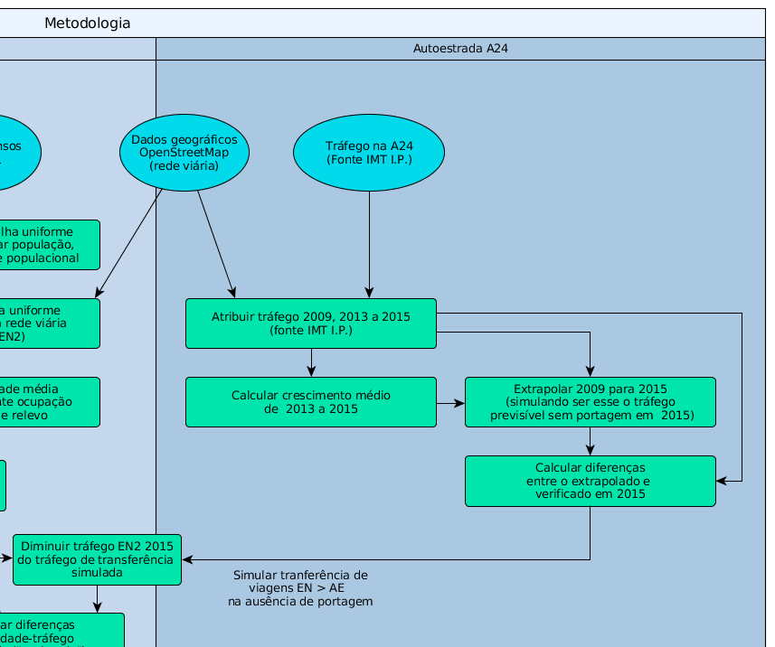

# Análise empírica

\label{chap:eemp}

> Nota: As figuras e tabelas neste capítulo provém de elaboração própria, sobre dados obtidos das fontes indicadas em cada caso.

## Introdução 

A análise empírica baseia-se na aplicação a um caso de estudo centrado na autoestrada A24 - Autoestrada do Interior Norte que liga Viseu à fronteira com Espanha, junto a Chaves, ver \autoref{loc}. Esta figura o contorno de Portugal Continental provém da Carta Administrativa de Portugal (CAOP) 2016 da Direção Geral do Território.

{ width=200px height=300px }

Centrar-nos-emos nos troços que fazem a ligação entre os limites da cidade de Vila Real e Chaves. Como trajeto alternativo será considerada a Estrada Nacional Nº2 entre os limites de Vila Real e o centro de Chaves.

A experimentação efetuada tem como objetivo mostrar que a cobrança de portagem na autoestrada provoca uma diminuição na respetiva procura que, necessariamente, se reflete numa transferência de viagens entre autoestrada e estrada alternativa. 

Se esta estrada alternativa tiver troços cuja situação habitual é de congestionamento, ou próxima disso, por a procura que nela incide estar junto, ou já ter ultrapassado, os limites físicos de capacidade de acomodação do tráfego nesta via, a referida transferência de viagens irá agravar a situação pré-existente, criando ou aumentando congestionamento.

Coerentemente com a contextualização teórica que foi produzida nos capítulos anteriores, esta análise de congestionamento será baseada no cálculo e na comparação de custos monetários e comparar-se-á carga, ou procura, com capacidade disponível da estrada existente. 

Para este efeito precisamos de:

- caracterizar o traçado geométrico das vias;
- caracterizar o relevo atravessado e as limitações à circulação que daí podem advir (inclinações acentuadas, quantidade de curvas, curvas muito acentuadas);
- caracterizar o tipo de ocupação humana das áreas atravessadas pela via e as implicações da mesma na circulação (exemplos: elevada procura, obstruções à livre circulação, passadeiras, semáforos, medidas de acalmia de tráfego, etc.;
- caracterizar o volume de tráfego existente;
- caracterizar a capacidade máxima de tráfego, para cumprir um determinado nível de serviço;
- atribuir a troços geométricos estas características;
- contabilizar custos de congestionamento em função de diferenças entre quantidade de tráfego e capacidade disponível, por troço;
- comparar custos entre diferentes cenários e com os valores da cobrança de portagem.

## Suporte de software

A metodologia descrita nos passos seguintes exige a utilização de software de Sistemas de Informação Geográfica (SIG) e de base de dados relacional geográfica. O software usado corresponde às versões mais recentes de:

- QGIS (SIG Desktop)
- PostgreSQL + PostGIS (Base de dados geográfica)

O software SIG Desktop permite-nos compor os mapas apresentados nas páginas seguintes. O carregamento, a manipulação dos dados e as operações de análise espacial foram executadas directamente no software de base de dados. Esta opção é tida como mais difícil, uma vez que o SIG Desktop é considerado mais amigável para estas tarefas. Contudo, ao efetuar as tarefas de análise na própria base de dados, algumas das operações podem ser disponibilizadas na forma de "vistas" que se mantém permanentemente atualizadas, podendo os dados de base ser alterados ou completados e os resultados são calculados de forma totalmente automática.

Como o SIG Desktop se liga diretamente à base de dados, a capacidade de apresentação dos dados e resultados mantém-se permanentemente. Assim, os referidos resultados automáticos podem resultar em cartografia temática perante o simples refrescar da janela do mapa.

A utilização deste software permite-nos caracterizar a rede viária, a distribuição espacial da população, etc. num nível de detalhe tão grande quanto desejado e a resolução espacial dos dados de base o permitir.

## Licenciamento de dados e software

Esta análise empírica é construída sobre software e dados disponíveis sob licenciamento aberto (excepto no caso dos dados de tráfego cedidos pela Infraestruturas de Portugal SA). Pretende-se que, como outras, esta dissertação possa servir de apoio pedagógico de utilização aberta e, deste ponto de vista, parece-nos importante que, pelo facto de serem usados software e dados sem limitações de licenciamento, as hipóteses e os resultados aqui apresentados poderem ser livremente testadas (as hipóteses) e reproduzidos (os resultados) em qualquer contexto.

Caso se pretenda usar ou reproduzir os dados abaixo indicados como fornecidos pela Infraestruturas de Portugal, esta entidade deverá ser previamente contactada para devidamente contextualizar e autorizar essa utilização.

## Metodologia usada

O ano de referência para a análise e para os preços usados é 2015.

A análise a efectuar seguirá os seguintes passos:

1. definir geometricamente os troços de estrada nacional e de autoestrada a analisar;
2. atribuir condições de relevo limitantes do tráfego rodoviário na estrada nacional;
3. atribuir níveis de ocupação humana / urbana a cada troço de estrada nacional;
4. calcular uma capacidade máxima para os troços de estrada nacional a partir dos dados de relevo e de nível de ocupação;
5. atribuir volumes de tráfego aos troços de autoestrada e de estrada nacional;
6. estimar o tráfego na autoestrada sem portagem, projectando os valores de 2009 para o ano de referência;
7. calcular a diferença entre o tráfego sem portagem e o tráfego verificado na autoestrada;
8. alocar esta diferença do ponto 7. aos troços da estrada nacional, subtraindo-o ao tráfego verificado em 2015, simulando uma transferência de viagens da estrada nacional para a autoestrada, como se não existisse de portagem;
9. calcular custos de congestionamento "existentes", comparando o tráfego verificado em 2015 com a capacidade de cada troço de estrada nacional.
10. calcular custos de congestionamento "projetados", calculando a diferença entre o valor do tráfego calculado no ponto 8. e a capacidade de cada troço de estrada nacional.
11. comparar a diferença entre custo de congestionamento diário total "projetado" e "existente", da estrada nacional, com o valor diário de cobrança de portagem na autoestrada.

O detalhe de valores de tráfego e de capacidade de tráfego por troço geométrico são calculados apenas para a estrada nacional uma vez que apenas nesta será feita a contabilização de custos de congestionamento, a autoestrada é considerada descongestionada na sua globalidade.

A metodologia a usar está graficamente descrita na figuras \ref{metodolog}, \ref{metodologA24} e \ref{metodologEN2}.

 

 

 
 
## Contextualização geográfica

Antes de mais começaremos por um exercício de contextualização geográfica da área de interesse. 

Interessa-nos, para já:

- caracterizar o traçado geométrico das vias;
- caracterizar o relevo atravessado e as limitações à circulação que daí podem advir (inclinações acentuadas, quantidade de curvas, curvas muito acentuadas);
- caracterizar o tipo de ocupação humana das áreas atravessadas pela via e as implicações da mesma na circulação (exemplos: elevada procura, obstruções à livre circulação, passadeiras, semáforos, medidas de acalmia de tráfego, etc.;
 
{ width=550px height=824px }

Na \autoref{imgref}, criada a partir de dados abertos dos serviços OpenStreetMap (OSM) e Shuttle Radar Topography Mission (SRTM) [^fnJAG], vemos o contexto geográfico da área do caso de estudo sobre o fundo de hipsometria da região (retirada do SRTM). Vemos também alguns polígonos OSM para nos dar algumas pistas visuais da ocupação de solo na área de interesse. Neste mapa temos não só os traçados das duas estradas a analisar mas também alguma da restante rede viária envolvente. A hierarquia viária está caracterizada por um código de cores. Identificados com estilos diferentes do restante da rede viária, estão identificadas as vias em análise:

- a estrada nacional EN2 a azul (59,06 km de extensão)
- a autoestrada A24 a carmim (59,09 km de extensão)

[^fnJAG]: SRTM em projeção PT-TM06 publicada pelo Prof. José Alberto Gonçalves da Fac. Ciências da Universidade do Porto e disponível [neste endereço eletrónico](http://www.fc.up.pt/pessoas/jagoncal/srtm/)

## Enquadramento geográfico: densidade de ocupação

A caracterização da ocupação humana baseia-se na informação dos Censos 2011 do Instituto Nacional de Estatística, obtida através da Base Geográfica de Referenciação de Informação (BGRI). 

Os polígonos de subsecção estatística contidos na BGRI têm a configuração necessária à gestão conveniente do trabalho de recolha de campo, que não é conveniente à espacialização na forma de uma superfície analítica que descreva grandezas como a distribuição espacial da densidade populacional. Entre vários outros aspectos problemáticos, estes polígonos tem uma grande variabilidade de áreas, cobrindo o espaço em análise de uma forma muito irregular e espacialmente desequilibrada. Assim torna-se necessário transformar os polígonos da BGRI numa matriz de figuras geométricas regulares à qual os valores de população possam ser distribuídos e fazer-se a sua espacialização de uma forma mais homogénea.

Seguindo os trabalhos que tem vindo a ser desenvolvidos no âmbito das chamados *Discrete Global Grid Systems* [@sahr] foi decidido usar uma matriz regular de hexágonos. Segundo Sahr, as matrizes de hexágonos são visualmente mais apelativas e são mais eficientes na amostragem dos dados, quer como cobertura única quer como hierarquia de matrizes sobrepostas, por exemplo para representar a informação espacializada a diferentes escalas.

A matriz usada foi definida com hexágonos cujo apotema é de 300 metros, cobrindo cada hexágono uma área de 31,177 ha, próxima da média das áreas dos polígonos de subsecção estatística que é de 34,821 ha. Na \autoref{cel_hexagonal} vemos uma célula hexagonal (linhas violeta) sobreposta às linhas fronteiras dos polígonos BGRI subjacentes (linhas negras).

{ width=250px height=250px }

Para atribuir os valores de população a cada célula hexagonal, o valor de cada célula é calculado de acordo com a equação \ref{CalcCH}.

\begin{center}
\begin{equation}
\label{CalcCH}
V_{ch} = \sum_{i=1}^{n} \frac{V_{i} * a_{I_i}}{a_{T_i}}
\end{equation}
\end{center}

Na \autoref{CalcCH}, temos que cada célula hexagonal intersecta $n$ polígonos de BGRI e assim:

- $V_{ch}$ é o valor a atribuir a cada célula hexagonal;
- $V_{i}$ é o valor de população do polígono BGRI $i$;
- $a_{I_i}$ representa a área do polígono resultante da intersecção entre o polígono BGRI $i$ e a célula hexagonal;
- $a_{T_i}$ representa a área total do polígono BGRI $i$.

Vemos assim que o valor da população de cada polígono BGRI (subsecção) é proporcionalmente distribuído pelas células hexagonais que o cobrem, proporcionalmente à razão entre a área de intersecção entre polígono BGRI e célula hexagonal, sobre o total da área do polígono de BGRI.

Na \autoref{popdens}, vemos uma representação temática da malha hexagonal de células já com a população atribuída e com a densidade populacional calculada. A classificação de cores corresponde a classes de densidade populacional, em habitantes por quilómetro quadrado. A classe dos valores de densidade mais baixos, menos de 20 hab/km^2^, foi removida para maior clareza de visualização.

{ width=550px height=824px }

## Um primeiro produto: cálculo de custo de oportunidade

A partir dos dados de comprimento das vias anteriormente calculados, podemos fazer um primeiro exercício quantitativo simples. Poderemos tentar calcular de forma muito sumária, um custo de oportunidade usando:

- os comprimentos das estradas atrás indicados, calculados no SIG;
- velocidades médias genéricas para a totalidade da estrada nacional (50 km/h) e da autoestrada (120 km/h);
- o salário médio nacional dos trabalhadores por conta de outrem para 2015 (€ 1096.7) [@pordata:salmed].

\newpage

Calculemos então:

\begin{center}
\begin{equation}
\label{CustOp}
\begin{aligned}
t_{EN} =  60 * \left(\frac{59.062}{50}\right) \approx 71 min. \\ \\
t_{AE} =  60 * \left(\frac{59.095}{120}\right) \approx 33 min. \\ \\
t_{diff} = 71 - 33 = 38 min. \\ \\
custo_{hora} = 1096.7 / \frac{20}{8} = \text{\euro} 6.85 \\ \\
custo_{oport} = 6.85 * \frac{38}{60} = \text{\euro} 4.338 \\ \\
\end{aligned}
\end{equation}
\end{center}

Temos assim que:

- $t_{EN}$ representa o tempo de percurso na estrada nacional;
- $t_{AE}$ representa o tempo de percurso na estrada nacional;
- $t_{diff}$ representa a diferença de tempos de percurso;
- $custo_{hora}$ representa um valor horário de salário (durante horas de trabalho);
- $custo_{oport}$ será o valor final do custo de oportunidade;

Na equação \ref{CustOp} obtemos um custo de oportunidade de € 4.338 muito próximo do valor da taxa de portagem cobrada (€ 4.5). Estes valores estão abaixo do valor calculado com base na taxa de referência atualizada (€ 0,098 / km) que seria de € 5,79. 

Este facto faz suspeitar que as taxas, cujo algoritmo de cálculo acaba por nunca ser publicado, possam efetivamente ser definidas com base em custos de oportunidade.

## Continuação da análise

A análise a efectuar continuará pelos seguintes passos:

1. atribuir volumes de tráfego aos troços de autoestrada e de estrada nacional;
2. calcular uma capacidade máxima para os troços de estrada nacional;
3. estimar o tráfego na autoestrada sem portagem, projectando os valores de 2009 para o ano de referência;
4. calcular a diferença entre o tráfego sem portagem e o tráfego verificado na autoestrada;
5. alocar esta diferença do ponto 4. aos troços da estrada nacional, subtraindo-ao ao tráfego verificado em 2015, simulando uma transferência de viagens da estrada nacional para a autoestrada, como se não existisse de portagem;
6. calcular custos de congestionamento "existentes", comparando o tráfego verificado em 2015 com a capacidade de cada troço de estrada nacional.
7. calcular custos de congestionamento "projetados", calculando a diferença entre o valor do tráfego calculado no ponto 5. e a capacidade de cada troço de estrada nacional.
8. comparar a diferença entre custo de congestionamento diário total "projetado" e "existente", da estrada nacional, com o valor diário de cobrança de portagem na autoestrada.

### Atribuição dos valores de volume de tráfego

Manipulando a informação de base de geográfica em software adequado de Sistema de Informação Geográfica (SIG) e de base de dados geográfica relacional (BDGR), executou-se o carregamento dos dados de volume de tráfego disponíveis. Antes, as vias, autoestrada e estrada alternativas, foram geometricamente seccionadas de acordo com os troços para os quais estão disponíveis os dados de tráfego e, no caso da autoestrada, os dados de taxa de portagem.

Os dados de volume de tráfego são habitualmente expressos em tráfego médio diário anual (TMDA) [^fnTMDA]. Para as autoestradas,  existem valores publicados desde há vários anos. Para a estrada nacional foram fornecidos, a pedido, pela empresa Infraestruturas de Portugal, SA para troços e janela temporal bem definidos. Foi possível obter para os troços em causa os anos de 2013 a 2015 com algumas descontinuidades, com ausência de dados de 2013 para os troços de Benagouro-Flores, PAguiar-Benagouro e VPAguiar-PedrasSalgadas.

Por lapso, não foi obtido o ano de 2009 para a estrada nacional. Este foi o último ano de funcionamento do acesso livre nas ex-SCUT e iremos considerar os respectivos valores de tráfego na autoestrada como referência para a procura sem portagem. Seria interessante possuir os valores correspondentes na estrada nacional nesse ano.

[^fnTMDA]: valor do tráfego diário em número de veículos, sob a forma de média anual.

\begin{center}
\fontsize{10pt}{12pt}\selectfont
\begin{threeparttable}[h]
\centering
\caption{Volumes de tráfego TMDA nas vias analisadas, anos de 2009 e 2013 a 2015}
\label{voltrad}

\begin{tabular}{|lllll|llll|}
\hline
\rowcolor[HTML]{C0C0C0} 
Estrada & Troço                 & Ano  & TMDA &  & Estrada & Troço                   & Ano  & TMDA \\ \hline
A24     & Chaves-EN103          & 2009 & 5098 &  & A24     & VPAguiar-A7             & 2014 & 3594 \\ \hline
A24     & Chaves-EN103          & 2013 & 3552 &  & A24     & VPAguiar-A7             & 2015 & 3821 \\ \hline
A24     & Chaves-EN103          & 2014 & 3594 &  & A24     & VPAguiar-Fortunho       & 2009 & 4767 \\ \hline
A24     & Chaves-EN103          & 2015 & 3665 &  & A24     & VPAguiar-Fortunho       & 2013 & 3132 \\ \hline
A24     & EN103-Vidago          & 2009 & 5517 &  & A24     & VPAguiar-Fortunho       & 2014 & 3176 \\ \hline
A24     & EN103-Vidago          & 2013 & 3966 &  & A24     & VPAguiar-Fortunho       & 2015 & 3393 \\ \hline
A24     & EN103-Vidago          & 2014 & 4071 &  & EN2     & Benagouro-Flores        & 2014 & 8247 \\ \hline
A24     & EN103-Vidago          & 2015 & 4233 &  & EN2     & Benagouro-Flores        & 2015 & 5854 \\ \hline
A24     & Fortunho-VilaRealIP4  & 2009 & 5509 &  & EN2     & Chaves-VidagoA24        & 2013 & 3087 \\ \hline
A24     & Fortunho-VilaRealIP4  & 2013 & 4870 &  & EN2     & Chaves-VidagoA24        & 2014 & 3150 \\ \hline
A24     & Fortunho-VilaRealIP4  & 2014 & 5000 &  & EN2     & Chaves-VidagoA24        & 2015 & 3193 \\ \hline
A24     & Fortunho-VilaRealIP4  & 2015 & 5312 &  & EN2     & Vidago-PedrasSalgadasN  & 2013 & 2692 \\ \hline
A24     & PedrasSalgadas-A7     & 2009 & 5837 &  & EN2     & Vidago-PedrasSalgadasN  & 2014 & 2732 \\ \hline
A24     & PedrasSalgadas-A7     & 2013 & 4529 &  & EN2     & Vidago-PedrasSalgadasN  & 2015 & 3409 \\ \hline
A24     & PedrasSalgadas-A7     & 2014 & 4688 &  & EN2     & Vidago-VidagoA24        & 2013 & 4300 \\ \hline
A24     & PedrasSalgadas-A7     & 2015 & 4923 &  & EN2     & Vidago-VidagoA24        & 2014 & 4364 \\ \hline
A24     & Vidago-PedrasSalgadas & 2009 & 5861 &  & EN2     & Vidago-VidagoA24        & 2015 & 4079 \\ \hline
A24     & Vidago-PedrasSalgadas & 2013 & 4454 &  & EN2     & VPAguiar-Benagouro      & 2014 & 8284 \\ \hline
A24     & Vidago-PedrasSalgadas & 2014 & 4575 &  & EN2     & VPAguiar-Benagouro      & 2015 & 6907 \\ \hline
A24     & Vidago-PedrasSalgadas & 2015 & 4771 &  & EN2     & VPAguiar-PedrasSalgadas & 2014 & 4226 \\ \hline
A24     & VPAguiar-A7           & 2009 & 4088 &  & EN2     & VPAguiar-PedrasSalgadas & 2015 & 4108 \\ \hline
A24     & VPAguiar-A7           & 2013 & 3556 &  &         &                         &      &      \\ \hline
\end{tabular}

\begin{tablenotes}\footnotesize
    \item Fontes: Infraestruturas de Portugal (IP) (Estrada EN2) e Instituto da Mobilidade e Transportes (IMT) (Estrada A24)
    \item Atenção, acesso possivelmente reservado: a Infraestruturas de Portugal deverá ser consultada quanto à possibilidade de utilização ou reprodução dos dados que forneceu
 \end{tablenotes}
 
\end{threeparttable}

\end{center}

Os dados disponibilizados pela IP incluíram também a percentagem de veículos pesados, em valores que não ultrapassam os 12%.

### Alocação de densidades de ocupação e de tipo de relevo

Vamos agora proceder à atribuição de qualificações aos troços de estrada nacional que nos vão permitir calcular a respectiva capacidade máxima de tráfego.

Para proceder à alocação de densidade de ocupação (urbano, periurbano, rural), os troços de via foram geometricamente intersectados com os polígonos da malha hexagonal usada para espacializar os dados demográficos de forma espacialmente homogénea.

{ width=200px height=200px }

\newpage

A correspondência feita entre o tipo de ocupação e densidade populacional é indicada pela seguinte chave:

- densidade inferior a 200 hab./km^2^: rural;
- densidade entre 200 e 900 hab./km^2^: periurbano;
- densidade acima de 900 hab./km^2^: urbano;

Da informação demográfica alocada a cada hexágono podemos atribuir a respetiva qualificação de densidade de ocupação a cada pequeno troço de rede viária resultante da interseção geométrica.

Estes pequenos troços serviram depois de base para a atribuição manual de características de relevo da seguinte forma: no software de SIG Desktop usado, os troços foram manualmente seleccionados e, a cada conjunto foi atribuído um qualificativo de "montanhoso", "misto" ou "plano", por mera comparação visual com o tema da hipsometria. O resultado é mostrado na \autoref{ocup_relevo}.

Na tabela \ref{ocup_relevo} foi também atribuída de forma empírica, seguindo a experiência pessoal do autor, uma velocidade ideal de circulação para cada uma das combinações de ocupação e relevo. A coluna velocidade "free flow" será explicada na secção seguinte.

\begin{center}
\fontsize{10pt}{12pt}\selectfont
\begin{threeparttable}[h]
\centering
\caption{Ocupação e relevo nos troços da estrada nacional EN2}
\label{ocup_relevo}

\begin{tabular}{| R{3.5cm} | R{3.5cm} | l | l | }
\hline
\rowcolor[HTML]{C0C0C0} 
Ocupação   & Relevo     & \begin{tabular}[c]{@{}l@{}}Vel. ideal \\ km/h\end{tabular} & \begin{tabular}[c]{@{}l@{}}Vel. “free flow” \\ km/h\end{tabular} \\ \hline
periurbano & misto      & 60                                                         & 53                                                               \\
periurbano & montanhoso & 45                                                         & 38                                                               \\
periurbano & plano      & 70                                                         & 63                                                               \\
rural      & misto      & 70                                                         & 63                                                               \\
rural      & montanhoso & 45                                                         & 38                                                               \\
rural      & plano      & 90                                                         & 83                                                               \\
urbano     & misto      & 45                                                         & 38                                                               \\
urbano     & plano      & 50                                                         & 43                                                               \\ \hline
\end{tabular}

\end{threeparttable}

\end{center}

### Cálculo de capacidade máxima 

Este cálculo de capacidade máxima dos troços de estrada nacional baseia-se nas indicações metodológicas do Highway Capacity Manual do Transportation Research Board norte-americano [@HCM_SpRep209].

A cada combinação de relevo e tipo de ocupação, atrás levantada, foi feita, como vimos, uma atribuição empírica de uma velocidade ideal. A velocidade "free flow" foi calculada de acordo com @HCM_SpRep209. Seguindo as tabelas 7-2 a 7-5 deste relatório técnico, foram calculadas várias reduções a aplicar, primeiro em milhas por hora (mph), depois devidamente convertidas para km/h. A redução geral aplicada foi assim de 7,24 km/h a todas as velocidades ideais.

As reduções específicas em mph (total: 4,5 mph) devem-se a:

- inexistência de separador central: 1,6;
- dimensões de berma: 0,4;
- dez cruzamentos e pontos de acesso por milha:	2,5.

A partir dos valores da tabela \ref{ocup_relevo} podemos calcular a capacidade de tráfego para cada classe de troço. Primeiro iremos calcular o volume de tráfego de ponta horário diário VHPd. Deste iremos obter depois valores de TMDA comparáveis com os dados de entrada disponíveis.

Vamos calcular valores de capacidade de tráfego para cada tipo de troço de estrada nacional com base nos cálculos indicados nas secções anteriores seguindo as indicações de @HCM_SpRep209.

O primeiro passo é calcular valores de volume de tráfego de ponta horário diário VHPd para a ausência de tráfego de veículos pesados.

Para isso, fazemos um cálculo sobre o gráfico \ref{speed_flow} [@HCM_SpRep209]. Para um dado valor de velocidade "free flow" da tabela \ref{ocup_relevo}, encontramos a abcissa correspondente no gráfico (convertendo primeiro os valores de velocidade de km/h em milhas por hora, mph). Em seguida seguimos no gráfico a linha horizontal correspondente ao valor seleccionado até encontrar a linha oblíqua correspondente ao nível de serviço pretendido (Level of service - LOS) (exemplo na figura \ref{graf_calc} ).

{ width=400px height=302px }

{ width=350px height=350px }

No caso português, o Plano Rodoviário Nacional prevê que as estradas nacionais tenham um nível de serviço C (LOS C).

Encontrado este ponto, o fluxo pretendido é o valor das abcissas correspondente.

\newpage

Este valor obtido é em VHPd e tem de ser convertido em TMDA. Para isso usamos a expressão

\begin{center}
\begin{equation}
\label{CalcTMDA}
V_{TMDA} =  V_{VHPd} * K * D
\end{equation}
\end{center}

Os valores de K e D usados estão na tabela \ref{k_d} e baseiam-se em @corrtraf.

\begin{center}
\fontsize{10pt}{12pt}\selectfont
\begin{threeparttable}[h]
\centering
\caption{Constantes K, D por troços de estrada nacional}
\label{k_d}

\begin{tabular}{|R{3cm}|R{3cm}|l|l|}
\hline
\rowcolor[HTML]{C0C0C0} 
Ocupação   & Relevo     & \multicolumn{1}{c|}{\cellcolor[HTML]{C0C0C0}K} & \multicolumn{1}{c|}{\cellcolor[HTML]{C0C0C0}D} \\ \hline
periurbano & misto      & 0,2                                            & 0,72                                           \\
periurbano & montanhoso & 0,2                                            & 0,72                                           \\
periurbano & plano      & 0,2                                            & 0,72                                           \\
rural      & misto      & 0,14                                           & 0,6                                            \\
rural      & montanhoso & 0,14                                           & 0,6                                            \\
rural      & plano      & 0,1                                            & 0,57                                           \\
urbano     & misto      & 0,14                                           & 0,6                                            \\
urbano     & plano      & 0,1                                            & 0,57                                           \\ \hline
\end{tabular}

\end{threeparttable}

\end{center}

Calculados todos os valores necessários para a ausência de tráfego de veículos pesados, falta calcular os valores correspondentes para diferentes percentagens de tráfego de pesados.

As fórmulas de @HCM_SpRep209 para esse efeito são especialmente difíceis de aplicar por exigirem o conhecimento de características adicionais sobre o tráfego de pesados. Assim foi feita uma adaptação por comparação com valores de exemplo dados em @HCM_SpRep209.

O resultado final está mostrado na tabela \ref{capacidade}.

\begin{center}
\fontsize{10pt}{12pt}\selectfont
\begin{threeparttable}[h]
\centering
\caption{Capacidades de tráfego em troços da estrada nacional EN2}
\label{capacidade}

\begin{tabular}{|ll|l|l|l|l|l|}
\hline
                                                       &            & \multicolumn{5}{c|}{\cellcolor[HTML]{C0C0C0}Capacidade TMDA}                                                                                                                                                                                                                                                                                                                                                                                                                                                                   \\ \hline
\rowcolor[HTML]{C0C0C0} 
\multicolumn{1}{|l|}{\cellcolor[HTML]{C0C0C0}Ocupação} & Relevo     & \multicolumn{1}{c|}{\cellcolor[HTML]{C0C0C0}\begin{tabular}[c]{@{}c@{}}ausência\\ pesados\end{tabular}} & \multicolumn{1}{c|}{\cellcolor[HTML]{C0C0C0}\begin{tabular}[c]{@{}c@{}}5\%\\ pesados\end{tabular}} & \multicolumn{1}{c|}{\cellcolor[HTML]{C0C0C0}\begin{tabular}[c]{@{}c@{}}10\%\\ pesados\end{tabular}} & \multicolumn{1}{c|}{\cellcolor[HTML]{C0C0C0}\begin{tabular}[c]{@{}c@{}}15\%\\ pesados\end{tabular}} & \multicolumn{1}{c|}{\cellcolor[HTML]{C0C0C0}\begin{tabular}[c]{@{}c@{}}20\%\\ pesados\end{tabular}} \\ \hline
\multicolumn{1}{|l|}{periurbano}                       & misto      & 10595                                                                                                   & 4944                                                                                               & 4326                                                                                                & 3708                                                                                                & 3090                                                                                                \\
\multicolumn{1}{|l|}{periurbano}                       & montanhoso & 5952                                                                                                    & 2778                                                                                               & 2431                                                                                                & 2083                                                                                                & 1736                                                                                                \\
\multicolumn{1}{|l|}{periurbano}                       & plano      & 12500                                                                                                   & 5833                                                                                               & 5104                                                                                                & 4375                                                                                                & 3646                                                                                                \\
\multicolumn{1}{|l|}{rural}                            & misto      & 7292                                                                                                    & 5833                                                                                               & 5104                                                                                                & 4375                                                                                                & 3646                                                                                                \\
\multicolumn{1}{|l|}{rural}                            & montanhoso & 3472                                                                                                    & 2778                                                                                               & 2431                                                                                                & 2083                                                                                                & 1736                                                                                                \\
\multicolumn{1}{|l|}{rural}                            & plano      & 9722                                                                                                    & 7778                                                                                               & 6806                                                                                                & 5833                                                                                                & 4861                                                                                                \\
\multicolumn{1}{|l|}{urbano}                           & misto      & 8772                                                                                                    & 2778                                                                                               & 2431                                                                                                & 2083                                                                                                & 1736                                                                                                \\
\multicolumn{1}{|l|}{urbano}                           & plano      & 12281                                                                                                   & 3889                                                                                               & 3403                                                                                                & 2917                                                                                                & 2431                                                                                                \\ \hline
\end{tabular}

\end{threeparttable}

\end{center}

### Cálculo do estado de congestionamento existente

\label{chap:bandas}

Para este efeito baseamo-nos em @ricardo.

Este relatório técnico define um conjunto de *bandas de congestionamento* definidas a partir do quociente tráfego / capacidade (v/c):

- fluxo livre: v/c até 0.75;
- próximo do limite de capacidade: v/c acima de 0.75 e menor que 1.0;
- capacidade excedida: v/c maior que 1.0.

O mapa da figura \ref{bandas} mostra a expressão destas bandas nos troços da EN2. Podemos ver que existe uma extensão significativa para a qual o tráfego verificado em 2015 excede a capacidade disponível.

{ width=550px height=824px }

### Estimativa do volume de tráfego sem portagem

Pretendemos fazer o cálculo de *bandas de congestionamento* para o cenário de cessação da cobrança de portagem da autoestrada e consequente diminuição da procura na estrada nacional. Para isso iremos estimar um volume de tráfego na autoestrada sem portagem. A diferença entre esse tráfego estimado e o tráfego efetivamente verificado na autoestrada servirá para simular o decréscimo de procura na estrada nacional, pelo que assumiremos que as viagens adicionais esperadas na autoestrada corresponderiam todas elas a substituições de viagem na estrada nacional.

Para estimarmos quais seriam os valores de volume de tráfego na autoestrada em 2015 se não existissem portagens, aplicamos aos valores de 2009 (ano antes da aplicação de portagens na A24) o crescimento médio que o mesmo tráfego tem sentido entre 2013 e 2015 (tabela \ref{aumentos}).

\begin{center}
\fontsize{10pt}{12pt}\selectfont
\begin{threeparttable}[h]
\centering
\caption{Aumentos de tráfego 2013-2015 na A24}
\label{aumentos}

\begin{tabular}{| R{6cm} |c|}
\hline
\rowcolor[HTML]{C0C0C0} 
\multicolumn{1}{|c|}{\cellcolor[HTML]{C0C0C0}Troço A24} & \% aumento \\ \hline
Fortunho-VilaRealIP4                                & 4.45       \\
Chaves-EN103                                        & 1.58       \\
VPAguiar-Fortunho                                   & 4.12       \\
Vidago-PedrasSalgadas                               & 3.5        \\
PedrasSalgadas-A7                                   & 4.26       \\
EN103-Vidago                                        & 3.31       \\
VPAguiar-A7                                         & 3.69       \\ \hline
\end{tabular}

\end{threeparttable}

\end{center}

Aplicando estas taxas de crescimento obtemos um conjunto de valores de tráfego por troço da A24. A estes foram subtraídos os valores, assumidos como correntes, de 2015. De seguida, simularemos a transferência entre os troços da estrada nacional e a autoestrada, como efeito da aplicação das portagens. Assim os valores na tabela \ref{transferencia} simulam diminuições esperadas em cada troço de estrada nacional no caso de cessação de cobrança de portagem na autoestrada.

\begin{center}
\fontsize{10pt}{12pt}\selectfont
\begin{threeparttable}[h]
\centering
\caption{Simulação transferência tráfego EN2 > A24}
\label{transferencia}

\begin{tabular}{| R{8cm} |l|}
\hline
\rowcolor[HTML]{C0C0C0} 
Troço EN2               & \multicolumn{1}{c|}{\cellcolor[HTML]{C0C0C0}\begin{tabular}[c]{@{}c@{}}Transferência\\ TMDA\end{tabular}} \\
Chaves-VidagoA24        & 80                                                                                                        \\
Vidago-VidagoA24        & 182                                                                                                       \\
Benagouro-Flores        & 245                                                                                                       \\
Vidago-PedrasSalgadasN  & 205                                                                                                       \\
VPAguiar-PedrasSalgadas & 401                                                                                                       \\
VPAguiar-Benagouro      & 196                                                                                                       \\ \hline
\end{tabular}

\end{threeparttable}

\end{center}

O mapa da figura \ref{bandas2} mostra a expressão destas bandas recalculadas nos troços da EN2, perante a diminuição de tráfego esperada pela cessação da cobrança de portagem na A24. Podemos ver que ainda existe uma extensão significativa para a qual o tráfego excede a capacidade disponível.

{ width=550px height=824px }

### Cálculo de custos de congestionamento na estrada nacional

O ano de referência para os preços usados é 2015.

Para medir o impacto da introdução de portagens sobre os custos de congestionamento, teremos de medir:

- os custos do congestionamento existentes na estrada nacional (2015);
- os custos de congestionamento esperados na estrada nacional, simulando a supressão da portagem e a correspondente transferência entre estrada nacional e autoestrada.

O impacto corresponderá então à diferença entre estes dois valores.

Assim, às bandas de congestionamento calculadas na subsecção \ref{chap:bandas} foram aplicados os custos genéricos por unidade de volume de tráfego (em veículos * quilómetro, vkm), adaptados de @ricardo e ajustados a 2015, apresentados na \autoref{custos_vkm}.

\begin{center}
\fontsize{10pt}{12pt}\selectfont
\begin{threeparttable}[h]
\centering
\caption{Custos de congestionamento por unidade de volume de tráfego (vkm)}
\label{custos_vkm}

\begin{tabular}{| R{8cm} |l|l|}
\hline
\rowcolor[HTML]{C0C0C0} 
Banda congestionamento      & \multicolumn{1}{c|}{\cellcolor[HTML]{C0C0C0}\begin{tabular}[c]{@{}c@{}}Custo ligeiros \\ €/vkm\end{tabular}} & \multicolumn{1}{c|}{\cellcolor[HTML]{C0C0C0}\begin{tabular}[c]{@{}c@{}}Custo pesados \\ €/vkm\end{tabular}} \\ \hline
fluxo livre          & 0.00428                                                                                                      & 0.00856                                                                                                     \\
no limite capacidade & 0.19581                                                                                                      & 0.37236                                                                                                     \\
excedida capacidade  & 0.649                                                                                                        & 1.23371                                                                                                     \\ \hline
\end{tabular}

\end{threeparttable}

\end{center}

Da aplicação destes custos aos volumes de tráfego obtidos por conversão dos fluxos de tráfego TMDA disponíveis para valores em vkm, temos que existe um custo diário de cerca de €126700. Dividindo pelo número de veículos, poderíamos ter uma "portagem" de €0.85 para ligeiros e de €1.61 para pesados, a aplicar na estrada nacional.

### Cálculo da diferença de custos de congestionamento

Aplicando os custos unitários de congestionamento da tabela \ref{custos_vkm} aos valores de tráfego de estrada nacional subtraídos dos valores da simulação de transferência indicados na tabela \ref{transferencia}, obtêm-se um custo de congestionamento diário de cerca de €92700. Tendo em conta que existirá um custo diário de cerca de €126700 (calculado na subsecção anterior) a diferença é de €34000, é este o custo de congestionamento diário induzido na EN2 pela existência de portagem na autoestrada próxima.

Falta apenas comparar este valor com a receita diária de portagem. Dos valores de tráfego registados a média TMDA da autoestrada A24 em 2015 era de cerca de 4390 veículos. Multiplicando este valor por €4.5 de portagem temos uma receita diária de cerca de €19755.

Assim temos que o custo de congestionamento diário calculado é quase o dobro da receita de portagem.

# Conclusão

Portugal é um país com um défice histórico de infraestruturas de transporte, tendo se tornado nas últimas duas décadas particularmente bem servido em rede de autoestradas. Apesar deste esforço positivo, continuam a existir desequilíbrios, havendo áreas do país que continuam a ser servidas deficientemente em infraestrutura rodoviária.

Uma das situações que se verifica é a existência de autoestrada disponível cujo acesso, na verdade, é efetivamente limitado pela cobrança de portagens. Em muitos casos, o valor de portagem cobrado não deverá permitir cobrir os custos da infraestrutura em tempo útil e, ao ser cobrado, o acesso à infraestrutura disponível é, em alguns casos, fortemente limitado.

A análise empírica fornece indícios de que, de facto e entre outros, os custos de congestionamento nas estradas alternativas às autoestradas portajadas podem ser significativos e a imposição de portagens nas autoestradas, além de limitarem o acesso a um bem público que está, na maioria dos casos, longe de ficar congestionado, pode provocar aumentos significativos do estado de congestionamento daquelas, o que representa uma perda de bem estar social.

Estes custos não entram em linha de consideração com outras possibilidades de custos adicionais decorrentes, por exemplo, da sinistralidade e do ambiente que poderiam tornar este resultado ainda mais expressivo.

Dos resultados da análise empírica, podemos fazer as seguintes sugestões, no caso da A24 e da estrada nacional EN2:

1. a portagem na autoestrada A24 deveria ser abolida;
2. poderia ser considerado um sistema de cobrança de custos de congestionamento implementado sobre sistemas de cobrança eletrónica como os usados na autoestrada;
3. O pagamento dos custos, do investimento inicial e outros, da A24 devem ser arrecadados de outra forma que não pela cobrança de portagens, nomeadamente a partir das taxas e impostos ligados ao tráfego automóvel.

Como foi referenciado, a forma como o custo de congestionamento foi aqui calculado é simplista e esta análise deveria ser reproduzida de forma mais sustentada, baseada em modelos de simulação de tráfego.
