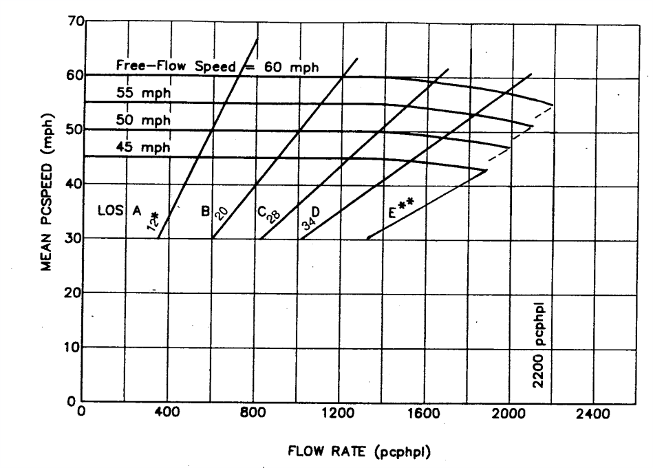

# Análise empírica

\label{chap:eemp}

> Nota: As figuras e tabelas neste capítulo provém de elaboração própria, sobre dados obtidos das fontes indicadas em cada caso.

## Introdução 

A análise empírica baseia-se na aplicação a um caso de estudo centrado na autoestrada A24 - Autoestrada do Interior Norte que liga Viseu à fronteira com Espanha, junto a Chaves, ver figura \ref{loc}. Esta figura o contorno de Portugal Continental provém da Carta Administrativa de Portugal (CAOP) 2016 da Direção Geral do Território.

{ width=200px height=300px }

Centrar-nos-emos nos troços que fazem a ligação entre os limites da cidade de Vila Real e Chaves. Como trajeto alternativo será considerada a Estrada Nacional Nº2 entre os limites de Vila Real e o centro de Chaves.

A experimentação efetuada tem como objetivo mostrar que a cobrança de portagem na autoestrada provoca uma diminuição na respetiva procura que, necessáriamente, se reflete numa transferência de viagens entre autoestrada e estrada alternativa. 

Se esta estrada alternativa tiver troços cuja situação habitual é de congestão, ou próxima disso, por a procura que nela incide estar junto, ou já ter ultrapassado, os limites físicos de capacidade de acomodação do tráfego nesta via, a referida transferência de viagens irá agravar a situação pré-existente, criando ou aumentando congestão.

Coerentemente com a contextualização teórica que foi produzida nos capítulos anteriores, esta análise de congestão e comparando carga, ou procura, com a capacidade disponível existente será baseada no cálculo e na comparação de custos monetários. 

Para este efeito precisamos de:

- caraterizar o traçado geométrico das vias
- caracterizar o relevo atravessado e as limitações à circulação que daí podem advir (inclinações acentuadas, quantidade de curvas, curvas muito acentuadas)
- caracterizar o tipo de ocupação humana das áreas atravessadas pela via e as implicações da mesma na circulação (exemplos: elevada procura, obstruções à livre circulação, passadeiras, semáforos, medidas de acalmia de tráfego, etc.
- caracterizar o volume de tráfego existente
- caracterizar a capacidade máxima de tráfego para cumprir um determinado nível de serviço
- atribuir a troços geométricos estas características
 
 

Na \autoref{imgref}, criada com dados abertos dos serviços OpenStreetMap (OSM) e Shuttle Radar Topography Mission (SRTM) [^fnJAG], vemos o contexto geográfico da área do caso de estudo. A hierarquia viária está caraterizada por um código de cores. Identificados com estilos diferentes do restante da rede viária, estão identificadas as vias em análise:

- a estrada nacional EN2 a azul (59,06 km de extensão)
- a autoestrada A24 a carmim (59,09 km de extensão)

[^fnJAG]: SRTM em projeção PT-TM06 publicada pelo Prof. José Alberto Gonçalves ac. Ciências UP e disponível [neste endereço eletrónico](http://www.fc.up.pt/pessoas/jagoncal/srtm/)

## Um primeiro cálculo de custo de oportunidade

A partir destes dados de comprimento, podemos fazer um primeiro exercício quantitativo simples. Poderemos tentar calcular de forma muito sumária, um custo de oportunidade usando:

- os comprimentos atrás indicados;
- velocidades médias genéricas para a totalidade da estrada nacional (50 km/h) e da autoestrada (120 km/h);
- o salário médio dos trabalhadores por conta de outrém (€ 1096.7) [@pordata:salmed].

Calculemos então:

\begin{center}
\begin{equation}
\label{CustOp}
\begin{aligned}
t_{EN} =  60 * \left(\frac{59.062}{50}\right) \approx 71 min. \\ \\
t_{AE} =  60 * \left(\frac{59.095}{120}\right) \approx 33 min. \\ \\
t_{diff} = 71 - 33 = 38 min. \\ \\
custo_{hora} = 1096.7 / \frac{20}{8} = \text{\euro} 6.85 \\ \\
custo_{oport} = 6.85 * \frac{38}{60} = \text{\euro} 4.338 \\ \\
\end{aligned}
\end{equation}
\end{center}

Na equação \ref{CustOp} obtemos um custo de oportunidade de € 4.338 muito próximo do valor da taxa de portagem cobrada (€ 4.5). Estes valores estão abaixo do valor calculado com base na taxa de referência atualizada (€ 0,098 / km) que seria de € 5,79. 

Este facto faz suspeitar que, efetivamente, as taxas cujo algoritmo de cálculo acaba por nunca ser publicado, possam ser definidas com base em custos de oportunidade.

## Enquadramento geográfico: densidade de ocupação

Para termos noção da população vizinha destas vias e da sua distribuição espacial, vemos na \autoref{imgref} o contexto geográfico agora contendo uma grelha hexagonal de densidade populacional. A dimensão de cada célula é definida de forma a ter aproximadamente a área duma subsecção estatística. Esta elaboração prória foi produzida com base na informação geográfica (BGRI) dos Censos 2011 do Instituto Nacional de Estatística (INE).

## Execução da análise

O ano de referÊncia para a análise e os preços usados é 2015.

A análise a efectuar seguirá os seguintes passos:

1. atribuir volumes de tráfego aos troços de autoestrada e de estrada nacional;
2. calcular uma capacidade máxima para os troços de estrada nacional;
3. estimar  o tráfego na autoestrada sem protagem, projectando os valores de 2009 para o ano de referência;
4. calcular a diferença entre o tráfego sem portagem e o tráfego verificado na autoestrada;
5. alocar esta diferença anterior aos troços da estrada nacional, simulando uma transferência de viagens da autoestrada para a estrada nacional em virtude da existÊncia de portagem;
6. calcular custos de congestão calculando a diferença entre o valor do tráfego calculado no ponto 5. e a capacidade de cada troço de estrada nacional.
7. comparar o custo de congestão diário total da estrada nacional com o valor diário de cobrança de portagem na autoestrada.

### Definição de traçados e atribuição dos valores de volume de tráfego

Manipulando a informação de base de geográfica em software adequado de Sistema de Informação Geográfica (SIG) e de base de dados geográfica relacional (BDGR), executou-se o carregamento dos dados de volume de tráfego disponíveis. Antes, as vias, autoestrada e estrada alternativas, foram geometricamente seccionadas de acordo com os troços para os quais estão disponíveis os dados de tráfego e, no csao da autoestrada, os dados de taxa de portagem.

Os dados de volume de tráfego são habitualmente expressos em tráfego médio diário anual (TMDA) [^fnTMDA]. Para as autoestradas,  existem valores publicados desde há vários anos. Para a estrada nacional foram fornecidos, a pedido, pela empresa Infraestruturas de Portugal, I.P. para troços e janela temporal bem definidos. Foi possível obter para os troços em causa os anos de 2013 a 2015 com algumas descontinuidades, com ausência de dados de 2013 para os troços de Benagouro-Flores, PAguiar-Benagouro e VPAguiar-PedrasSalgadas.

Por lapso, não foi obtido o ano de 2009 para a estrada nacional. Este foi o último ano de funcionamento do acesso livre nas ex-SCUT. 

[^fnTMDA]: valor do tráfego diário em número de veículos, sob a forma de média anual.

\begin{center}
\fontsize{10pt}{12pt}\selectfont
\begin{threeparttable}[h]
\centering
\caption{Volumes de tráfego TMDA nas vias analisadas, anos de 2009 e 2013 a 2015}
\label{voltrad}

\begin{tabular}{|lllll|llll|}
\hline
\rowcolor[HTML]{C0C0C0} 
Estrada & Troço                 & Ano  & TMDA &  & Estrada & Troço                   & Ano  & TMDA \\ \hline
A24     & Chaves-EN103          & 2009 & 5098 &  & A24     & VPAguiar-A7             & 2014 & 3594 \\ \hline
A24     & Chaves-EN103          & 2013 & 3552 &  & A24     & VPAguiar-A7             & 2015 & 3821 \\ \hline
A24     & Chaves-EN103          & 2014 & 3594 &  & A24     & VPAguiar-Fortunho       & 2009 & 4767 \\ \hline
A24     & Chaves-EN103          & 2015 & 3665 &  & A24     & VPAguiar-Fortunho       & 2013 & 3132 \\ \hline
A24     & EN103-Vidago          & 2009 & 5517 &  & A24     & VPAguiar-Fortunho       & 2014 & 3176 \\ \hline
A24     & EN103-Vidago          & 2013 & 3966 &  & A24     & VPAguiar-Fortunho       & 2015 & 3393 \\ \hline
A24     & EN103-Vidago          & 2014 & 4071 &  & EN2     & Benagouro-Flores        & 2014 & 8247 \\ \hline
A24     & EN103-Vidago          & 2015 & 4233 &  & EN2     & Benagouro-Flores        & 2015 & 5854 \\ \hline
A24     & Fortunho-VilaRealIP4  & 2009 & 5509 &  & EN2     & Chaves-VidagoA24        & 2013 & 3087 \\ \hline
A24     & Fortunho-VilaRealIP4  & 2013 & 4870 &  & EN2     & Chaves-VidagoA24        & 2014 & 3150 \\ \hline
A24     & Fortunho-VilaRealIP4  & 2014 & 5000 &  & EN2     & Chaves-VidagoA24        & 2015 & 3193 \\ \hline
A24     & Fortunho-VilaRealIP4  & 2015 & 5312 &  & EN2     & Vidago-PedrasSalgadasN  & 2013 & 2692 \\ \hline
A24     & PedrasSalgadas-A7     & 2009 & 5837 &  & EN2     & Vidago-PedrasSalgadasN  & 2014 & 2732 \\ \hline
A24     & PedrasSalgadas-A7     & 2013 & 4529 &  & EN2     & Vidago-PedrasSalgadasN  & 2015 & 3409 \\ \hline
A24     & PedrasSalgadas-A7     & 2014 & 4688 &  & EN2     & Vidago-VidagoA24        & 2013 & 4300 \\ \hline
A24     & PedrasSalgadas-A7     & 2015 & 4923 &  & EN2     & Vidago-VidagoA24        & 2014 & 4364 \\ \hline
A24     & Vidago-PedrasSalgadas & 2009 & 5861 &  & EN2     & Vidago-VidagoA24        & 2015 & 4079 \\ \hline
A24     & Vidago-PedrasSalgadas & 2013 & 4454 &  & EN2     & VPAguiar-Benagouro      & 2014 & 8284 \\ \hline
A24     & Vidago-PedrasSalgadas & 2014 & 4575 &  & EN2     & VPAguiar-Benagouro      & 2015 & 6907 \\ \hline
A24     & Vidago-PedrasSalgadas & 2015 & 4771 &  & EN2     & VPAguiar-PedrasSalgadas & 2014 & 4226 \\ \hline
A24     & VPAguiar-A7           & 2009 & 4088 &  & EN2     & VPAguiar-PedrasSalgadas & 2015 & 4108 \\ \hline
A24     & VPAguiar-A7           & 2013 & 3556 &  &         &                         &      &      \\ \hline
\end{tabular}

\begin{tablenotes}\footnotesize
    \item Fontes: Infraestruturas de Portugal (IP) e Instituto da Mobilidade e Transportes (IMT)
 \end{tablenotes}
 
\end{threeparttable}

\end{center}

Os dados sisponibilizados pela IP incluiram também a percentagem de veículos pesados, em valores que não ultrapassam os 12%.

### Cálculo de capacidade máxima 

Este cálculo de capacidade máxima dos troços de estrada nacional baseia-se nas indicações metodológicas de @HCM_SpRep209.

Importa começar por recolher duas caraterísticas importantes: relevo e densidade de ocupação urbana.

### Alocação de densidades de ocupação e de tipo de relevo

Vamos agora proceder à atrbuição de qualificações aos troços de estrada nacional que nos vão permitir calcular a respectiva capacidade máxima de tráfego.

Para proceder a alocação de densidade de ocupação (urbano, periurbano, rural), os troços de via foram geometricamente intersectados com os polígonos da malha hexagonal usada para espacializar os dados demográficos de forma espacialmente homogénea.

{ width=200px height=200px }

Da informação demográfica alocada a cada hexágono podemos atribuir uma qualificação de densidade de ocupação. Com esta operação de interseção, essa informação pode ser atribuída a cada pequeno troço resultante.

Estes peqenos troços serviram depois de base para a atribuição manual de caraterísticas de relevo da seguinte forma: no software de SIG usado, os troços foram manualmente seleccionados e, cada conjunto foi atribuído um qualificativo de "montanhoso", "misto" ou "plano". O resultado é mostrado na /ref{ocup_relevo}.

\begin{center}
\fontsize{10pt}{12pt}\selectfont
\begin{threeparttable}[h]
\centering
\caption{Ocupação e relevo nos troços da estrada nacional EN2}
\label{ocup_relevo}

\begin{tabular}{| R{3.5cm} | R{3.5cm} | l | l | }
\hline
\rowcolor[HTML]{C0C0C0} 
Ocupação   & Relevo     & \begin{tabular}[c]{@{}l@{}}Vel. ideal \\ km/h\end{tabular} & \begin{tabular}[c]{@{}l@{}}Vel. “free flow” \\ km/h\end{tabular} \\ \hline
periurbano & misto      & 60                                                         & 53                                                               \\
periurbano & montanhoso & 45                                                         & 38                                                               \\
periurbano & plano      & 70                                                         & 63                                                               \\
rural      & misto      & 70                                                         & 63                                                               \\
rural      & montanhoso & 45                                                         & 38                                                               \\
rural      & plano      & 90                                                         & 83                                                               \\
urbano     & misto      & 45                                                         & 38                                                               \\
urbano     & plano      & 50                                                         & 43                                                               \\ \hline
\end{tabular}

\end{threeparttable}

\end{center}

A estas combinações de relevo e tipo de ocupação foi feita uma atribuição empírica de uma velocidade ideal. A velocidade "free flow" foi calculada de acordo com @HCM_SpRep209. Seguindo as tabelas 7-2 a 7-5 deste relatório técnico, foram calculadas várias reduções a aplicar, primeiro em milhas por hora (mph), depois devidamente convertidas para km/h. A redução geral aplicada foi assim de 7,24 km/h a todas as velocidades ideiais.

As reduções específicas em mph (total: 4,5 mph):

- inexistência de separador central: 1,6	
- dimensões de berma: 0,4	
- dez cruzamentos e pontos de acesso por milha:	2,5	

A partir dos valores da tabela \ref{ocup_relevo} podemos calcular a capacidade de tráfego para cada classe de troço. Primeiro iremos calcular o volume de tráfego de ponta horário diário VHPd . Deste iremos obter depois valores de TMDA comparáveis com os dados de entrada disponíveis.

### Cálculo de capacidade

Vamos calcular valores de capacidade de tráfego para cada tipo de troço de estrada nacional com base nos cálculos indicados nas secções anteriores seguindo as indicações de @HCM_SpRep209.

O primeiro passo é calcular valores de volume de tráfego de ponta horário diário VHPd para a ausência de tráfego de veículos pesados.

Para isso, fazemos um cálculo sobre o gráfico \ref{speed_flow} [@HCM_SpRep209]. Para um dado valor de velocidade "free flow" encontramos o a abcissa correspondente no gráfico (valores em milhas por hora, mph). Em seguida seguimos no gráfico a linha horizontal correspondente ao valor seleccionado até encontrar a linha oblíqua correspondente ao nível de serviço pretendido (Level of service - LOS).

No caso português o Plano Rodoviário Nacional prevê que as estradas nacionais tenham um nível de serviço C (LOS C).

Encontrado este ponto o fluxo pretendido é o valor das abcissas correspondente.

Calculados todos os valores necessários para a ausência de tráfego de veículos pesados, falta calcular os valores correspondentes para diferentes percentagens de tráfego de pesados.

As fórmulas de @HCM_SpRep209 para esse efeito são especialmente difíceis de aplicar por exigirem o conhecimento de características adicionais sobre o tráfego de pesados. Assim foi feita uma adaptação por comparação com valores de exemplo dados em @HCM_SpRep209.

O resultado final está mostrado na tabela \ref{capacidade}.

\begin{center}
\fontsize{10pt}{12pt}\selectfont
\begin{threeparttable}[h]
\centering
\caption{Capacidades de tráfego em troços da estrada nacional EN2}
\label{capacidade}

\begin{tabular}{|ll|l|l|l|l|l|}
\hline
                                                       &            & \multicolumn{5}{c|}{\cellcolor[HTML]{C0C0C0}Capacidade TMDA}                                                                                                                                                                                                                                                                                                                                                                                                                                                                   \\ \hline
\rowcolor[HTML]{C0C0C0} 
\multicolumn{1}{|l|}{\cellcolor[HTML]{C0C0C0}Ocupação} & Relevo     & \multicolumn{1}{c|}{\cellcolor[HTML]{C0C0C0}\begin{tabular}[c]{@{}c@{}}ausência\\ pesados\end{tabular}} & \multicolumn{1}{c|}{\cellcolor[HTML]{C0C0C0}\begin{tabular}[c]{@{}c@{}}5\%\\ pesados\end{tabular}} & \multicolumn{1}{c|}{\cellcolor[HTML]{C0C0C0}\begin{tabular}[c]{@{}c@{}}10\%\\ pesados\end{tabular}} & \multicolumn{1}{c|}{\cellcolor[HTML]{C0C0C0}\begin{tabular}[c]{@{}c@{}}15\%\\ pesados\end{tabular}} & \multicolumn{1}{c|}{\cellcolor[HTML]{C0C0C0}\begin{tabular}[c]{@{}c@{}}20\%\\ pesados\end{tabular}} \\ \hline
\multicolumn{1}{|l|}{periurbano}                       & misto      & 10595                                                                                                   & 4944                                                                                               & 4326                                                                                                & 3708                                                                                                & 3090                                                                                                \\
\multicolumn{1}{|l|}{periurbano}                       & montanhoso & 5952                                                                                                    & 2778                                                                                               & 2431                                                                                                & 2083                                                                                                & 1736                                                                                                \\
\multicolumn{1}{|l|}{periurbano}                       & plano      & 12500                                                                                                   & 5833                                                                                               & 5104                                                                                                & 4375                                                                                                & 3646                                                                                                \\
\multicolumn{1}{|l|}{rural}                            & misto      & 7292                                                                                                    & 5833                                                                                               & 5104                                                                                                & 4375                                                                                                & 3646                                                                                                \\
\multicolumn{1}{|l|}{rural}                            & montanhoso & 3472                                                                                                    & 2778                                                                                               & 2431                                                                                                & 2083                                                                                                & 1736                                                                                                \\
\multicolumn{1}{|l|}{rural}                            & plano      & 9722                                                                                                    & 7778                                                                                               & 6806                                                                                                & 5833                                                                                                & 4861                                                                                                \\
\multicolumn{1}{|l|}{urbano}                           & misto      & 8772                                                                                                    & 2778                                                                                               & 2431                                                                                                & 2083                                                                                                & 1736                                                                                                \\
\multicolumn{1}{|l|}{urbano}                           & plano      & 12281                                                                                                   & 3889                                                                                               & 3403                                                                                                & 2917                                                                                                & 2431                                                                                                \\ \hline
\end{tabular}

\end{threeparttable}

\end{center}

 

