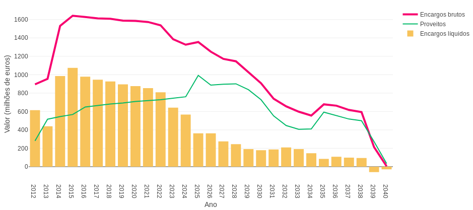
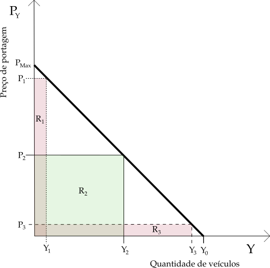

# Resumo

Portugal foi sujeito, até ao final do século XX, a um défice crónico de infraestruturas, nomeadamente de transporte. No dealbar do século XXI, sucessivos governos colocaram em marcha um programa muito ambicioso de construção rodoviária, com recurso a entidades privadas, que implicou investimentos de montante elevado, suportado em crédito. Uma pressão política inexorável, interna e externa, no final da década de 2010 forçou a redução do elevado grau de endividamento da República. Neste processo, o Estado promoveu fortemente a redução de todo o tipo de encargos e a obtenção de fontes de receita adicional. Como aquele programa de construção rodoviária tinha (e tem) um peso importante no dito endividamento, por decisão política, promoveu-se a taxação geral, via portagens, de todos os troços de autoestrada. Alguns troços tinham sido disponibilizados em acesso livre e grátis, essa situação foi alterada não restando hoje nenhuma ligação de autoestrada que não seja portajada.
A aplicação do chamado "princípio do utilizador-pagador" orienta politicamente estas decisões. Segundo este, os serviços e bens públicos devem ser financiados essencialmente por quem os realmente utiliza / consome. Este princípio parece gozar de aceitação significativa na sociedade portuguesa. Assim a introdução de portagens ocorreu apenas sob o protesto local das populações das áreas de influência mais atingidas pela medida.
De imediato, houve uma queda de procura muito sensível nas autoestradas recém-portajadas e, igualmente, foi muito sensível a degradação das condições de circulação e de segurança nos troços de "estrada nacional" alternativos. Estes troços alternativos tinham acabado de ser transferidos para a responsabilidade dos respectivos municípios que, justamente, os tinham transformado em vias urbanas, com condições de circulação e de velocidade máxima desajustadas ao tráfego de média e longa distância privilegiado pelas autoestradas.
Esta atitude da governação está em linha com a tendência de privatização sucessiva de áreas anteriormente da responsabilidade do Estado, privatização que ocorre com a principal intenção da boa performance financeira e do equilíbrio de contas. Para fomentar a procura do privado e a clareza de contas, promove-se uma compartimentação de "áreas de negócio" para as quais se contabilizam os encargos e proveitos estritamente desse âmbito, desprezando externalidades negativas, sobretudo as mais difíceis de contabilizar. Assim a perda de utilidade social da autoestrada e a congestão dos troços alternativos por virtude da introdução de portagens são completamente desprezados. O efeito das melhorias de acessibilidade, por exemplo, nas receitas fiscais é algo considerado complexo e fora da contabilidade dos empreendimentos rodoviários. De igual forma, não é abordado o cálculo de custos de congestão nas estradas alternativas. Se o objectivo do privado é, neste caso, meramente o de fornecer um serviço bem delimitado no espaço e no tempo (projecto, financiamento, construção e operação duma autoestrada específica que no final dum certo prazo reverte para o Estado), o do Estado é, globalmente, promover o bem estar dos cidadãos. O benefício social da boa acessibilidade e o custo da congestão de vias de circulação local, por muito difíceis de contabilizar que sejam, existem. O papel do Estado é de garantir que mantém ou aumenta o benefício social líquido, não é admissível que o diminua.

Esta dissertação pretende contribuir para este debate com o ensaio de metodologias de contabilização de externalidades decorrentes da introdução de portagens, e de análise de custos e benefícios específicas para o âmbito rodoviário que ajudem a demonstrar como, de forma global, o Estado e todos nós ficamos a perder com a situação presente da aplicação de portagens.

**Palavras-chave**: Autoestrada, portagem, benefício social líquido, custos de congestão

## Abstract

Up to late XX^th^ century, Portugal lagged behind most european counterparts in road infraestructure. An ambitious plan of investment with private-public credit-funded partnerships was put in place. At the end of 2010 decade, the Republic's debt was internationally considered excessive, internal and external political pressure forced it to be reduced. Government pursued overall relaxation of State costs and the maximizing of additional revenue sources. An important part of public debt originated from the road infraestruture programme, the government decided that additional revenue should come from tolling. In the first years of the programme, several new highway routes were free from tolls. After this decision no toll-free highway routes were left. This change was faced with mild opposition from public, only locally affected social groups organized some protests, of little impact.
As the general tolling scheme was imposed immediately highway demand fell sharply. Before this, when free highways were available , alternative roads were freed from previous traffic congestion and were handed from central government administration to municipalities, who implemented changes like new pavements and traffic calming measures, making them even less appropriate for medium or long distance road journeys. When the all-tolling scheme started, part of the highway-going traffic returned back to these alternative roads, restoring the previous congestion levels on an even less favourable environment, for exemaple, forcing even slower average speeds than before.
This government line of action is consistent with the ongoing overall intent of incremental privatization of State areas of intervention, focused on finantial performance. In order to attract private investiment and promote sound accountability, "business areas" are strictly defined in order to clearly measure all costs and revenues. In this process, externalities difficult to account for are put aside as State-only responsabilities. In the road tolling scheme case, the value of the external cost of alternative road congestion and the value of  public benefit from highway use are considered too difficult to calculate. The effect of highway availability on local economies and the expected associated tax revenue increase is also considered too difficult to be calculated properly. So, these impacts are kept out from road project accounting. From the private investor point-of-view this is ok, it's responsability is solely to design, finance, build and operate the road. As for the State, this situation is unacceptable as it should, by all means, globally promote citizen welfare. External benefits and costs are real, despite any difficulties in valuating them. State must promote welfare, not diminish it.

This dissertation tries to contribute to this debate by essaying analysis and valuation methods for external costs and benefits, specific of road projects and will try to help showing that the whole portuguese society loses with an all-routes fixed toll collecting scheme.

**Keywords** Highway, toll, net social benefit, congestion pricing

\onehalfspacing

# Introdução

O modelo DBFO (*Design, Build, Finance, Operate*) usado no projecto, construção e exploração da rede rodoviária da Grã-Bretanha *circa* 1992 serviu de exemplo à aplicação de  parcerias publico-privadas em projectos rodoviários (PPPR) em Portugal. A intenção dos promotores políticos destas iniciativas era conseguir, em prazo curto, vencer a significativa desvantagem do país, face aos parceiros europeus, em infraestruturas de transporte. A aplicação do modelo PPP aos projectos rodoviários, ao permitir ultrapassar certas limitações à despesa de um estado significativamente endividado, surgiu como única possibilidade de resolver este problema. Na implementação de PPPR destacam-se, a partir de 1997, as chamadas SCUT, autoestradas sem custos directos para o utente, cujo acesso livre poderia contribuir para diminuir as marcantes assimetrias socioeconómicas das regiões interiores do país. A perspectiva positiva deste acesso livre foi ensombrecida quando, a partir de 2006, entidades fiscalizadoras das contas públicas chamaram veementemente a atenção para um crescente distanciamento entre custos previstos e custos efectivos da execução destes projectos. Um conjunto de decisões mal informadas, assumidas ao longo deste processo, levou a este estado de coisas. Perante a pressão política, interna e externa, para diminuir certos encargos do Estado considerados excessivos e a atenção pública focada no descontrole da despesa em PPRR os executivos em funções em 2010 e 2011 cancelaram o acesso livre nos troços SCUT com a introdução de portagens. De imediato, em determinados troços, a procura caiu duma forma expressiva, ficando mesmo abaixo dos limites técnicos de referência que justificam a criação de autoestradas, ameaçando quer o objectivo da própria colecta de receitas quer o efeito socioeconómico positivo que se pretendia provocar. Esta atitude do poder político revela uma visão estreita apenas preocupada com "fluxos de caixa" e que despreza quer os benefícios da existência de autoestradas quer os custos de congestão e sobre-ocupação das vias alternativas causados por haver exclusão do acesso à autoestrada de todos aqueles que não estiverem dispostos a pagar a respectiva taxa de portagem.

Começaremos por enquadrar historicamente a situação das infraestruturas rodoviárias portuguesas. 

# Enquadramento histórico do tema

Portugal era até ao final do século XX um país com um défice crónico em infraestruturas de transporte. Esta deficiência atingia de igual forma os modos de transporte rodoviário e ferroviário, o transporte individual e colectivo.

Na segunda metade do século XIX, o transporte colectivo em modo ferroviário cresceu de forma significativa [@cf1801_1930]. Contudo, um conjunto de vicissitudes ao longo do século XX até meados dos anos 90 levaram a que muitos serviços ferroviários em funcionamento acabassem encerrados e os planos de crescimento dos existentes abandonados.

O incremento do transporte rodoviário, possibilitado pela implementação de um plano de infraestruturas rodoviárias posto em curso após o final da Segunda Guerra [@prn], apesar de relativamente tímido comparativamente a outros esforços ocorridos no continente europeu (ver a extensão baixíssima de autoestradas em Portugal em comparação aos restantes países europeus até aos anos 1990 em @pordata:extaes), ofereceu a possibilidade de uma oferta de serviços com uma cobertura espacial do país mais completa do que tinha sido possível com a ferrovia de início e meados do século XX.

O investimento na rodovia foi sucessivamente crescendo, sofrendo um fortíssimo incremento já no início do século XXI [@pordata:extaes]. Paralelamente a ferrovia foi deixada para segundo plano, acabando severamente depreciada com ajuda da concorrência directa do modo rodoviário.

Até chegarmos às décadas finais do século XX, o investimento no modo rodoviário foi sendo sucessivamente incrementado, sem acompanhamento pelo sistema ferroviário.

A intensidade desta aposta e o esforço aplicado neste desígnio foram de tal ordem que hoje existe, em volta das principais áreas metropolitanas do nosso país periférico, uma densidade de vias da melhor qualidade, as chamadas "autoestradas", que rivaliza com a densidade das mesmas nas áreas metropolitanas mais ricas e populosas do centro da Europa Ocidental, centro económico da União Europeia a que hoje pertencemos [@glease].

## Um esforço intenso

Contudo, o esforço aplicado no crescimento das infraestruturas rodoviárias sujeitou as contas do Estado a um esforço financeiro elevado, baseado em dívida e na preocupação de um suposto "custo zero": entidades privadas assumiram elevados custos fixos, na expectativa da cobrança ao erário público de variadas rendas e compensações ao longo de décadas. Dessa forma, o impacto desses custos nas contas do Estado vai sendo diferido no tempo e suavizado, mesmo que à custa do pagamento de substanciais juros bancários.

O modelo DBFO (*Design, Build, Finance, Operate*) importado do Reino Unido [@dbfo_uk] serviu de inspiração ao desenvolvimento de parcerias publico-privadas nas quais, sem prescindir da posse dos terrenos e das construções realizadas, o estado entrega a uma entidade privada, sob concessão, as tarefas de projectar e construir, e o direito a explorar, novos empreendimentos rodoviários. Fica também do lado do privado obter o necessário financiamento.

Os princípios e objectivos dos projectos DBFO eram:

- garantir que cada rodovia seja projectada, mantida e gerida de forma satisfatória e segura
- minimizar os impactos adversos no ambiente e maximizar o benefício aos utentes
- transferir um nível apropriado de risco para o sector privado da economia
- promover a inovação, não só em questões técnicas e operacionais mas também em aspectos de financiamento e comerciais
- promover o desenvolvimento de um sector privado de operação rodoviária no Reino Unido
- minimizar a contribuição financeira do erário público.

Em 2008, num relatório de auditoria do Tribunal de Contas, [@TC2008] citado por [@hfernando], definia-se que:

> *As parcerias público-privadas constituem um modelo de contratação que permite ao Estado promover a obtenção de serviço público, através de uma estrutura contratual firmada com um parceiro privado, na qual se estabelecem obrigações mútuas que reflectem uma alocação, a ambas partes, dos riscos envolvidos*

Na documentação sobre os projectos e contratos DBFO, é indicado, sobre a transferência de riscos, que:

> *A alocação do risco e da recompensa entre as partes contratantes [Estado e privados] deverá ser claramente definida e os proveitos do sector privado deverão ser genuinamente sujeitos a riscos. Espera-se que os parceiros privados __assumam a maioria dos riscos__ associados ao projecto, construção , manutenção, operação e financiamento de cada projecto. Estes riscos incluirão desde riscos associados às obras de construção e de manutenção e respectivo ajuste aos tempos e fundos disponíveis e isto para um horizonte global de 30 anos de contrato.
(tradução, sublinhado e nota do autor, [@dbfo_uk])*

Esta indicação da assunção da maioria dos riscos pelo privado não parece que tenha se verificado na realidade, como à frente o autor tenta demonstrar.

Dentro do conjunto das parcerias publico-privadas rodoviárias (PPPR) previstas e realizadas tornaram-se notórios os empreendimentos SCUT, "Sem Custos para o UTente", nos quais a entidade concessionária recebe valores equivalentes a taxas de portagem, correspondentes à passagem de cada veículo, que lhe são entregues pelo Estado e não são cobrados aos utentes.

Num relatório de auditoria à gestão das PPPR SCUT em 2003 é referida uma «*[...] __falta de poder negocial que o Estado tem revelado__ face ao sector privado*» e que «*programa [SCUT] foi lançado sem se avaliar se o mesmo acarretaria value for money para o Estado*» [@TC2003].

Neste relatório são claramente assinalados diversos factores de risco desnecessariamente excessivo para o Estado e diversas situações absurdas, por exemplo, ao nível de atrasos no licenciamento ambiental dos projectos que levaram o Estado a ter de ressarcir os privados de forma totalmente previsível e desnecessária.

Este relatório assinala também que:

> *[...] merece reservas pelos elevados  custos  sociais daí resultantes, o  facto  de  o  Estado  assumir,  nestes  contratos,  durante  30  anos,  na prática, o risco de congelamento do Plano Rodoviário  Nacional  2000. Sucede,  com  efeito, que o Estado fica limitado  no  que  respeita  à melhoria do  nível  de  serviço  das  vias alternativas e impossibilitado  de construir novas vias , já que, para o concretizar, terá de compensar financeiramente as concessionárias.*

Apesar dos defeitos apontados, como refere Paulo Trigo Pereira [@ptpereira] citado em [@mbalseiro], o modelo é intensivamente aplicado:

> *[... existe uma] tendência para os governos lançarem PPP em excesso, dado que podem retirar um benefício político no lançamento dos projectos, realizar algum encaixe financeiro imediato e transferir para os governos seguintes o ónus da despesa e dos eventuais impostos acrescidos necessários para os financiar*.

Estavam assim criadas condições para que as PPPR e os projectos SCUT em particular viessem a colocar problemas inesperados e a fomentar derrapagens nas contas do Estado. Em 2010, Carlos Moreno salienta a existência de derrapagens financeiras nas SCUT que se terão ficado a dever a:

> *[...] atrasos nos processos de expropriação, à ausência de corredores ambientais previamente aprovados, a decisões unilaterais dos estado concedente, no sentido de alterar projectos já aprovados -- sem prévia quantificação nem análise da racionalidade dos custos adicionais daí derivados, bem como a pedidos sucessivos de obras adicionais, por parte de autarquias locais interessadas nos projectos.* [@cmoreno].

Muitas destas despesas não-previstas passariam, a dada altura, a ser enquadradas em contratos chamados de "reequilíbrio financeiro" (REF) nos quais o Estado compensava o custos adicionais do concessionário correspondentes às situações atrás citadas.

No relatório anual da Direcção Geral do Tesouro e Finanças de de 2009 de acompanhamento e de reporte dos contratos de PPP em curso [@dgtf2009] é apresentado o seguinte quadro acerca da situação dos PPPR inicialmente definidos como SCUT.

\begin{center}
\begin{threeparttable}[h]
\centering
\caption{Pagamentos líquidos do Estado no exercício de 2008}
\label{tabpagliq2008}
\begin{tabular}{|lllllr|}
\hline
Concessões SCUT             & OE 2008 (A) & Executado & REF  & Total (B) & \% B/A \\ \hline
Algarve (IC4/IP1)           & 45,4        & 43,3      &      & 43,3      & 95,4   \\
Beira Interior (IP2/IP6)    & 138,8       & 136,4     & 1,5  & 137,9     & 99,4   \\
Interior Norte (IP3)        & 107,5       & 92,4      &      & 92,4      & 86,0   \\
Costa de Prata (IC1/IP5)    & 71,8        & 71,6      &      & 71,6      & 99,7   \\
Grande Porto (IP4/IC24)     & 101,7       & 78,2      &      & 78,2      & 76,9   \\
Norte Litoral (IP9/IC1)     & 44,2        & 42,4      & 21,8 & 64,2      & \cellcolor{orange} 145,2  \\
Beiras Litoral e Alta (IP5) & 195,1       & 179,8     &      & 179,8     & 92,2   \\
Total                       & 704,5       & 644,1     & 23,3 & 667,4     & 94,7   \\ \hline
\end{tabular}

\begin{tablenotes}\footnotesize
    \item OE 2008 - Despesa prevista no Orçamento do Estado do ano de 2008
    \item REF - Contratos de reequilíbrio financeiro
    \item % B/A - Percentagem de execução real dos contratos
 \end{tablenotes}

\end{threeparttable}

\end{center}

Apesar da execução orçamental, de quase todos os empreendimentos, estar em linha com as previsões, vemos, no entanto, acerca da concessão Norte Litoral (IP9/IC1) (actuais A27 e A28, célula assinalada a cor \colorbox{orange}{laranja} na tabela \ref{tabpagliq2008}) temos, apenas neste ano de 2008, uma derrapagem de 45% devida aos atrás referidos problemas de licenciamento ambiental.

Mais tarde, no relatório anual de 2012 *Parcerias Público-Privadas e Concessões* da Direcção Geral do Tesouro, [@dgtf2012] podemos ver que o conjunto das PPPR apresenta, nesse ano, uma derrapagem global de 30%.

Na figura \ref{fluxos2012} vemos os encargos líquidos das PPPR para o Estado desde 2012 até ao ano de 2040, valores do referido relatório de 2012. Este foi o primeiro documento deste género produzido seguindo indicações do *Memorando de Entendimento sobre as Condicionalidades da Política Económica* acordado com a Comissão Europeia, o Fundo Monetário Internacional e o Banco Central Europeu, em consequência duma grave crise financeira do Estado e perante um pedido de auxílio financeiro às ditas entidades. Supostamente este documento terá tido um grau de rigor superior aos anteriores e terá envolvido uma equipa mais alargada que incluía, por exemplo, elementos do Banco de Portugal.

Não esquecendo que, desde 2012, ocorreram um conjunto de renegociações de contratos, podemos ver que nessa ocasião o Estado esperava ter um encargo líquido plurianual de mais de 13300 milhões de euros, correspondente a cerca de 16% do total da despesa do Estado em 2012 [^fn_desp].

Dividindo esse esforço em encargos anuais líquidos, podemos ver que o ano de maior esforço terá já ocorrido em 2015 com 1076 milhões de euros de encargo líquido, cerca de **1,2% da despesa do Estado desse ano** (base 2011, fonte [Pordata](https://www.pordata.pt) ).

[^fn_desp]: A despesa do Estado em 2012 terá sido cerca de 83370 milhões de euros (base 2011, fonte [Pordata](https://www.pordata.pt) )

Outros exemplos poderiam ser dados destas derrapagens e dos problemas financeiros destes empreendimentos. Contudo esta tarefa é dificultada pela complexidade técnica dos respectivos contratos e da *engenharia financeira* associada. Além disso, como refere Moreno, a adopção, a partir de 2007, de um novo modelo de financiamento do Estado às PPPR através da criação da empresa Estradas de Portugal E.P. contribuiu para uma menor transparência orçamental destes projectos.

Contudo, Moreno calculava para a globalidade das PPPR um valor de encargos plurianuais de 25 mil milhões de euros (valor nominal, preços correntes) ao longo de um prazo de 30 anos. Sobre este valor o mesmo autor estimava existir em 2010 uma derrapagem de cerca de 6%. [@cmoreno]

## Súbita mudança de orientação

Perante este cenário de fragilidade dos contratos das PPPR e perante uma degradação geral das contas do Estado, que levaria à já referida crise financeira grave, o governo português começou em 2009 a preparar a introdução de portagem em alguns dos troços de autoestrada sujeitos ao regime SCUT. Não serão alheias a estas medidas as pressões externas que se fazem sentir dos restantes países europeus para que Portugal cumprisse objectivos decorrentes do Pacto de Estabilidade e Crescimento, no qual cada estado-membro se compromete a conter o seu défice público e dívida pública dentro de limites bem definidos. Durante anos Portugal não cumpriu um ou ambos destes limites em especial o limite do défice a partir de 2001.

Daí decorreria a necessidade clara de diminuir a despesa pública e o endividamento. Como as PPPR representam uma significativa fonte de encargos para o Estado, certamente esta terá sido logo uma área a considerar para este efeito. Das globalidade das PPPR, os empreendimentos SCUT eram aqueles que apresentavam maior nível de encargos brutos, como é evidente na \ref{encargosBruto2012}.

\begin{threeparttable}[]
\centering
\caption{Encargos brutos}
\label{encargosBruto2012}
\begin{tabular}{l|llllll|}
\cline{2-7}
                                                            &           &      &  ano &      &      &      \\ \hline
\multicolumn{1}{|l|}{}                                      & 2000/2006 & 2007 & 2008 & 2009 & 2010 & 2011 \\ \hline
\multicolumn{1}{|l|}{Concessões do Estado}                  & 475       & 25   & 16   & 42   & 228  & 582  \\ \hline
\multicolumn{1}{|l|}{Concessões do Estado - SCUT e ex-Scut} & 482       & 537  & 641  & 648  & 718  & 1094 \\ \hline
\end{tabular}

\begin{tablenotes}\footnotesize
    \item Fonte: DGTF - “Parcerias Público-Privadas e Concessões – Relatório de 2012”
 \end{tablenotes}

\end{threeparttable}

\vspace*{1\baselineskip}

Para além do proveito da cobrança de portagem permitir equilibrar os elevados encargos das ex-SCUT, esta medida de introdução de portagens tinha também argumentos políticos: com esta medida o governo em funções pretendia também responder às pressões da oposição no sentido de reduzir despesa pública e contrariar a ideia de despesismo que publicamente vinha sendo associada às SCUT [@cmjornalScut]. A forças da oposição situadas mais à direita no espectro político faziam inclusivamente a defesa e promoção do chamado princípio do *utilizador-pagador*, perante o qual a situação ideal para controlar a despesa do Estado é garantir que os beneficiários de cada serviço público cubram os custos do mesmo, em oposição à ideia de que, essencialmente, os serviços públicos deverão ser pagos pelos impostos cobrados à generalidade dos cidadãos.

Assim, foi prevista a cobrança de direitos de passagem em múltiplos troços de autoestrada por via da aplicação de portagens aos respectivos utilizadores. Esta medida política foi aplicada em troços para os quais a aplicação de portagens não tinha sido, na sua maioria, prevista, quer em projecto quer em obra. Em muitos destes troços ainda hoje não existem locais previamente configurados para a instalação de praças de portagem com cabinas de cobrança. Essa aparente dificuldade acabou por ser contornada com a implementação de sistemas electrónicos de cobrança recorrendo a dispositivos próprios carregados por cada veículo.

Esta medida continha vários aspectos contraditórios, entre os quais o facto de alguns dos troços a portajar haviam sido construídos sobre antigos troços de estrada nacional. Ao portajar estes troços, as populações locais foram deixadas sem quaisquer ligações rodoviárias alternativas.

Já em 2006 a empresa Estradas de Portugal havia encomendado um estudo com o objectivo de preparar a introdução faseada de portagens nas SCUT. Este estudo preparado pela empresa F9 Consulting propunha-se fazer ...

> *[...] o cômputo dos cálculos necessários para aplicação de um conjunto de critérios para determinação das concessões rodoviárias em regime SCUT em condições de passar a ser regidas pelo princípio do utilizador-pagador.* [@F9Consulting_2006]

Este estudo pretende sugerir que existe possibilidade de compatibilizar o objectivo de aumento de proveitos, com a cobrança de portagens, com os objectivos de discriminação positiva regional que nortearam a introdução das SCUT. A justificação da introdução de portagens não é minimamente descrita nem enquadrada neste trabalho, é apenas um dado adquirido. O estudo resume-se na sua essência à aplicação um método quantitativo arbitrário a um conjunto de indicadores regionais como:

- índices de disparidade do PIB per capita regional
- índice do Poder de Compra Concelhio (IPCC)
- tempo de percurso das vias alternativas

... para determinar quais os troços que deveriam ser portajados e quais deveriam manter-se no regime SCUT.

Das seis concessões/troços analisadas o estudo concluí pela introdução de portagem em três. Esta divisão acabou por ser, em grande parte, inútil uma vez que, em Outubro de 2010, estes troços passaram a ser portajados e, passado pouco mais de um ano, em Dezembro do ano seguinte, a cobrança de portagem foi alargada a todas as restantes ex-SCUT.

Apesar da pretensa preocupação de clareza que, supostamente, teria norteado este estudo, passados vários anos da introdução de portagens na generalidade dos troços de autoestrada em Portugal continua não ser explícito para o público o método de definição dos valores de taxas de portagem.

Para este efeito, o Decreto-Lei n.º 111/2011 fixa um valor de referência de €0,06671/km (s/ IVA), valores com referência a Dezembro de 2006 e actualizáveis pelo IPC de Dezembro de cada ano. Como se chegou a este valor não é explicado. Por outro lado, a lei abre múltiplas possibilidade de variação que são efectivamente aplicadas no terreno duma forma absolutamente nada transparente.

# Definição do problema

Apesar da premente e compreensível necessidade na obtenção de proveitos que equilibrem os elevados encargos dos empreendimentos PPPR, a medida de taxação generalizada por via da imposição de portagens nas autoestradas portuguesas não pode deixar de suscitar múltiplas e fundadas dúvidas quer no seu efeito socioeconómico quer na sua capacidade para, de facto, alcançar os seus objectivos.

Analisemos primeiro do ponto de vista do cumprimento do objectivo de acumulação de receita suficiente para cobrir o investimento o avultado investimento inicial.

## Acumulação de receitas, cobertura do investimento inicial

Se a introdução da cpbrança de portagens nas nossas autoestradas visa cobrir, ou ajudar a cobrir, os encargos financeiros elevados que decorrem do igualmente elevado montante do investimento inicial, para que surta o desejado efeito de geração de proveitos, deve corresponder à definição de um preço de portagem que permita maximizar esse proveito e à definição de um período necessário a acumular a receita necessária.

Da consulta à legislação vigente e aos sítios web dos concessionários sabemos que o valor da taxa a cobrar é definido pelo governo.

Na figura \ref{maxportg} aplicamos ao bem "autoestrada" o que a teoria microeconómica apelida de curva de procura, de inclinação negativa, adequada à situação de monopólio típica do provimento de infraestruturas rodoviárias: embora haja intervenção de privados, o provimento é da exclusiva responsabilidade do Estado, não haverá espaço para o surgimento de concorrentes. No eixo das abcissas temos quantidades de procura **Y**, correspondentes a número de veículos (volume de tráfego) que atravessam uma qualquer autoestrada enquanto nas ordenadas valores de taxa de portagem **P~y~**. A curva tem inclinação negativa porque, com taxa zero (P~0~) temos um máximo de volume de tráfego Y~0~ enquanto que, a partir de uma determinada taxa máxima P~Max~, a autoestrada, espera-se, ficará vazia.

Com um valor de taxa P~3~ baixo a via em causa terá grande procura mas o rendimento de portagem, correspondente à área R~3~, será baixo. Com uma taxa de valor P~1~, teremos uma procura e um rendimento R~1~ ambos baixos. Com uma taxa P~2~, temos um rendimento máximo correspondente à maior das três áreas, R~2~. Há aqui que ter algum bom senso entre a maximização do rendimento e a evidência que, ao subir a taxa, estamos efectivamente a limitar o acesso a um bem que se supõe público (mais à frente isto será mais discutido).

{ width=300px height=300px }

Do ponto de vista da cobertura dos encargos financeiros importaria maximizar a receita, espera-se assim que a taxa definida pelo Estado decorra de um raciocínio atrás produzido. 

Contudo, para ter a garantia que a efectiva cobertura dos encargos existentes está assegurada, esta definição da taxa não é suficiente. O raciocínio sobre o gráfico aplica-se a um dado perído de cobrança. Se a unidade de medida que usamos nas abcissas for o volume de tráfego TMDA (Tráfego Médio Diário Anual) a nossa maximização foi calculada para um dia e assim teremos:

\begin{center}
\begin{equation}
\label{maxR}
R = V_{TMDA} * P_{max} * N_{D}
\end{equation}
\end{center}

Em que $P_{max}$ é o valor de taxa correspondente à receita máxima por dia e $N_{D}$ o número de dias necessários para obter o rendimento $R$.

Para que, pelo menos, o valor do rendimento $R$ cubra o investimento inicial necessita-se que se registem os volumes de tráfego $V_{TMDA}$ necessários durante o prazo considerado razoável. Atentemos contudo que algumas destas vias atravessam regiões apenas capazes de gerar volumes de tráfego modestos. Além disso, existindo vias alternativas a imposição ou o aumento de taxas de portagem tem um efeito de quebra no volume tráfego, correspondente a:

- viagens abandonadas, o utente desiste de fazer a viagem em transporte pessoal;
- viagens que passam a fazer-se pelo trajecto alternativo.  

A melhor eficácia, do ponto de vista da arrecadação de receita, da aplicação de taxas de portagem corresponde à situação em que a via portajada não tem alternativas e representa um acesso crucial a uma determinada região.

Um exemplo disto pode ser dado pela Ponte 25 de Abril sobre o Tejo, cujo financiamento foi também suportado em dívida como as actuais PPPR, de forma a diferir os encargos financeiros por um período de tempo alargado. O Estado considerou esse investimento pago ao final de cerca de apenas **17 anos** [@rodriges_ponte25a], à custa da cobrança de taxas de portagem. Durante anos esta foi a solução exclusiva para o acesso rodoviário entre a cidade de Lisboa e a margem sul do Tejo, com uma muito tímida concorrência exercida pelo o atravessamento fluvial via *ferry-boats*. Com a construção da ponte, iniciou-se uma ocupação de zonas residenciais da margem sul do Tejo das quais muitos moradores trabalham em Lisboa e nos concelhos limítrofes da margem norte do rio. Em resultado deste fenómeno, esta via está  sujeita a um astronómico volume de tráfego TMDA que, por exemplo, em 2015 atingia **135000 veículos** [@imt20153T]. A elevada procura potencial e a inexistência de alternativas permitiu colectar a totalidade dos proveitos necessários num prazo inferior em **13 anos** ao prazo dos PPPR actuais.

A maioria dos troços de ex-SCUT, apesar de terem custos de construção por unidade de comprimento substancialmente inferiores aos duma travessia do estuário do Tejo, estão todavia sujeitas a um volume de tráfego comparativamente muito reduzido. Eis alguns exemplos, dados de 2015  [@imt20153T]:

- autoestrada A23 (antiga SCUT Beira Interior) - valores de TMD mensal inferiores a 10000 numa grande parte dos troços, no inverno alguns destes troços apresentam valores próximos de 4000;
- autoestrada A24 (antiga SCUT Interior) - valores de TMD mensal globalmente inferiores a 10000 , no inverno alguns destes troços apresentam valores próximos de 2000;
- autoestrada A17 (parte da antiga SCUT Costa de Prata) - valores de TMD mensal globalmente inferiores a 10000 excepto em troços em volta da cidade de Aveio, no inverno alguns destes troços apresentam valores próximos de 2000.

 Estes valores são mais de 100 vezes inferior ao da Ponte 25 de Abril. Existe na bibliografia de suporte referências a limites empíricos de valores de TMDA entre 10000 e 18000 que justificam a transformação ou substituição de uma estrada de duas faixas de circulação por uma via de 2 ou mais faixas (@romana_hernando, @visao_atdesertas e [*Numbers every traffic engineer should know*](http://www.mikeontraffic.com/numbers-every-traffic-engineer-should-know/)). [^fn_critSinistralidade][^fnTRB]

 Muitos troços de autoestrada existentes não chegam a cumprir minimamente este critério.

[^fn_critSinistralidade]: Este não será o único critério, esta decisão poderá ser tomada por outros factores como questões peculiares de sinistralidade ou outras
[^fnTRB]: A generalidade das metodologias de planeamento de rodovias usadas em todo mundo baseiam-se no trabalho pioneiro do Transportation Research Board norte-americano, reflectido, nomeadamente em [@HCM_SpRep209]), também referenciado no PRN2000 nacional.

Façamos então um pequeno ensaio para uma das novas autoestradas sujeitas a pagamento de portagem para as quais os volumes de tráfego não atingem sequer os 10000 TMDA: a autoestrada A17. Por consulta do sítio web da  [concessionária](http://www.brisa.pt/pt/Empresa-e-estrat%C3%A9gia/Atividade-empresarial/Concess%C3%B5es-rodovi%C3%A1rias/Brisal), vemos os seguinte números (Outubro de 2016):

- volume de tráfego TMDA: 5558 veículos/dia
- 575 milhões de euros (2004), 690 milhões ajustados a 2016 
- portagem €14
- comprimento de 92,7 km

Calculemos $N_{D}$:

\begin{center}
\begin{equation}
\label{nD}
N_{D} =  \frac{R}{V_{TMDA} * P_{max}}
\end{equation}
\end{center}

Segundo \ref{nD}, o valor de $N_{D}$ será de 8740 dias ou cerca de 24 anos. Tudo isto parece bem: a portagem em cobrança parece permitir cobrir o investimento inicial em menos de 30 anos (prazo habitual das concessões PPPR portuguesas). Não nos podemos esquecer de dois detalhes:

- os custos da infraestrutura não tem apenas a ver com o investimento incial;
- a portagem atualmente cobrada na A17 está **acima** da tarifa de referência para o valor por quilómetro actualizado para 2016 com IVA (€0,1510/km > €0,098/km).

Se usarmos o dito valor de referência actualizado para o mesmo cálculo, teríamos $N_{D}$ igual a 13665 dias, o que significa **mais de 37 anos**.

Estes cálculos são executados sobre valores médios e apenas pretendem dar uma ideia genérica das questões sobre as quais decisores políticos e técnicos são chamados a pronunciar-se. Mesmo assim, várias dúvidas podem imediatamente surgir relativamente à introdução de portagens, quer nas ex-SCUT quer nos novos troços de autoestrada portajada em zonas de reduzida procura:

- será possível pagar a totalidade de um investimento deste tipo com portagens ou apenas será viável cobrir uma parte dos custos?
- quais serão os limites razoáveis para o valor da taxa, como a calcular, sem perder de vista a utilidade social?
- definido um valor de taxa qual seria o limite máximo viável para o período de aplicação da mesma?

Como vimos na figura \ref{maxportg} as taxas de portagem de valores P~1~ e P~3~ produziriam os mesmos proveitos, é indiferente aplicar uma ou outra do ponto de vista do financiamento do empreendimento. Apesar disso, a utilidade social da autoestrada fica largamente reduzida se a taxa aplicada for P~3~ e não P~1~, uma vez que apenas nela circula um número reduzido de veículos. 

Assim, assumindo que a decisão de portajar um troço de autoestrada nestas condições é racional, tão importante como  a decisão de portajar seria a escolha de um valor efectivo de taxa de portagem a aplicar a qual, esperançadamente, deveria permitir a redução, ao mínimo possível, da quebra na utilidade pública da infraestrutura.

Contudo, poderemos considerar inaceitável qualquer quebra na utilidade da infraestrutura.

## Utilidade social em causa

Analisemos agora, de forma breve, o problema do provimento de autoestradas do ponto de vista da sua utilidade social e do seu impacto socioeconómico.

A construção de autoestradas visa genericamente providenciar melhorias de acessibilidade a regiões ou locais para os quais se considera que o sistema de infraestrutura rodoviária existente, sem autoestrada, não responde às necessidades das populações e dos agentes económicos. Esta é uma visão de escala maior, mais detalhada, a nível regional. A uma escala menor, nacional e internacional, a disponibilização de autoestradas visa melhorias de ligação entre centros urbanos e regiões distantes entre si ou a melhoria de interligação entre países, no nosso caso, com o país nosso vizinho, Espanha.

Do ponto de vista da escala nacional e internacional, as ligações criadas pela rede de autoestradas tem um carácter largamente insubstituível, uma vez que não existe verdadeira oferta concorrente quer de outras estradas, quer do modo ferroviário, quer do transporte aéreo. Este último apenas concorre nas ligações às principais cidades do país vizinho. Aqui, as estradas alternativas não permitem as velocidades elevadas admissíveis na autoestrada, tão necessárias à redução dos tempos de viagem nas deslocações de longo curso para valores considerados aceitáveis nos nossos dias. 

Vejamos o exemplo da ligação entre Aveiro e Madrid: 5:30 horas para vencer 520 km de estradas, na  indicação do serviço pesquisa de rotas online [Via Michelin](https://www.viamichelin.pt). A velocidade média desse trajecto é assim de 96 km/h. Fazendo este trajecto por estradas alternativas seria difícil manter uma velocidade média acima 50 km/h pelo que o tempo de deslocação seria provavelmente superior ao dobro deste tempo, mais de 11 horas, algo verdadeiramente fora dos nossos padrões actuais.

Na escala maior, a autoestrada enfrenta a concorrência directa das estradas preexistentes, nos casos em que estas não chegaram a ser substituídas por autoestrada, construída por cima, no mesmo corredor. Nesta escala e nestes casos, os utentes poderiam, na ausência de portagem, optar livremente entre usar as estradas antigas ou a autoestrada.

Nestes casos, quando a autoestrada foi disponibilizada ainda como SCUT, os utentes aderiram massivamente, abandonando em grande número os troços de estrada nacional que, maioritariamente, se encontravam degradados.

Libertadas de parte do seu intenso tráfego anterior e em linha com o disposto no Plano Rodoviário Nacional ([PRN2000, Dec.Lei 222/98](http://www.imt-ip.pt/sites/IMTT/Portugues/InfraestruturasRodoviarias/RedeRodoviaria/Documents/Plano_Rodoviario_Nacional.pdf)), as estradas nacionais abrangidas por esta transformação foram transferidas para a alçada dos respectivos municípios. Neste processo, muitas delas foram repavimentadas, reperfiladas e, em parte, transformadas em arruamentos com características urbanas. Além do mais, foram-lhe aplicadas medidas de acalmia de tráfego como rotundas, passadeiras, semaforização, etc. que reduzem de forma clara a capacidade destas em volume de tráfego e aumentam significativamente os tempos de deslocação ao forçarem uma circulação mais lenta e mais segura.

Com o fim do regime SCUT e a imposição de portagens, uma parte significativa dos respectivos utentes voltou a estas antigas estradas. O mesmo aconteceu em novos troços de autoestrada (exemplos: A17 Mira - Leiria Norte e A41 Alfena - Nogueira) que cobrem zonas de procura reduzida e foram abertos já em regime de cobrança de portagem: o efeito de substituição do uso das estradas pré-existentes pelo das autoestradas não chegou a ser significativo.

O novo carácter de via urbana de algumas das vias pré-existentes faz com que as baixas velocidades, demasiadamente baixas para quem está numa viagem de médio ou longo curso, produzam novamente uma congestão assinalável. Dantes a congestão era resultado do excesso de procura, agora resulta das já referidas medidas de acalmia de tráfego às quais se junta uma procura inesperadamente elevada, resultante do tráfego que não segue pelas autoestradas, face à aplicação de portagens.

O estudo do verdadeiro impacto destas alterações no tecido sócio económico é um trabalho ainda largamente incompleto.

## O dilema da aplicação de portagens

Estamos assim perante um dilema.

O país empenhou-se fortemente, endividando-se, na construção de uma rede de autoestradas que nos aproximasse dos níveis de serviço rodoviário existentes em muitos dos países nossos parceiros europeus. O crescimento desta parte da rede rodoviária visava proporcionar uma oferta de ligações de carácter regional, nacional e internacional com uma qualidade de serviço impossível na rede de estradas preexistente. Libertadas de parte substancial do antigo tráfego intenso, as antigas estradas ficariam disponíveis para ligações de carácter urbano e periurbano. Estas intenções visavam objectivos de promoção social e económica das regiões interiores do país. 

O objectivo de melhoria substancial do nível de serviço foi conseguido e até ultrapassado, com a contrapartida de um grande esforço financeiro que impactou nas contas públicas portuguesas, na pior das alturas, em pleno caminho para uma grave crise financeira.

Perante a necessidade urgente de reduzir custos de endividamento, o poder executivo decidiu promover a cobrança de portagens em troços inicialmente não abrangidos por tal exigência, cuja receita permitiria contribuir para amortizar esses custos.

Contudo, a imposição deste custo diminui drasticamente a utilidade destes troços de estrada melhorada. À vantagem de uma deslocação mais rápida e em melhores condições de segurança opõe-se a desvantagem do custo da portagem. Nos casos em que troços de autoestrada competem directamente com troços de estrada nacional alternativos, se os utentes considerarem que o valor da portagem paga não corresponde ao real benefício obtido em melhoria de tempo de deslocação e de condições de segurança, irão querer voltar aos antigos trajectos de estrada na nacional. Tendo em conta que estes sofreram um conjunto de alterações que diminuíram as velocidades praticáveis e a sua capacidade efectiva, neste caso, estes troços ficam de novo sujeitos a uma saturação que degrada o nível de serviço por estes oferecido e que tem profundo impacto na qualidade de vida das populações residentes nas imediações.

Assim, privado de parte da sua utilidade, privado de utentes, um investimento que teve custos muitos elevados para o erário público ficará por rentabilizar na sua plenitude e gera-se uma profunda contradição no sistema rodoviário ao permitir a continuada congestão de vias que deveriam ter sido libertadas para cumprir funções de ligação essencialmente local e urbana.

Eventualmente, nem mesmo o objectivo de colecta de fundos, com a cobrança de portagens, será cumprido em suficiência uma vez que, na realidade, os volumes de tráfego são, em vários troços, diminutos. Este facto sugere que a introdução de cobrança de portagem, em certos troços, pode mesmo ser contraproducente: nem há colecta substancial, nem as autoestradas cumprem cabalmente o objectivo para que foram criadas, o investimento realizado ficará por rentabilizar.

Não podemos deixar de sublinhar que, apesar dos múltiplos e evitáveis aspectos de má gestão salientados pelo Tribunal de Contas e outros, dando a azo a opiniões fortemente negativas muito propaladas na comunicação social, o real esforço financeiro não parecia exagerado em 2012 quando não se previa ultrapassar os 1,5% da despesa do Estado no ano de maior esforço. Essas previsões não contabilizavam ainda as chamadas subconcessões de corredores concessionados pelo Estado à empresa Infraestruturas de Portugal. Hoje sabemos, pelos trabalhos da UTAP [^fnUTAP], que o ano de maior esforço será mesmo o ano actual de 2017 e o valor atingido será um pouco acima da previsão de de 2012 num esforço que não parece, de todo, incomportável.

[^fnUTAP]: Unidade técnica de acompanhamento de projectos do Ministério das Finanças que produz Boletins Anuais e Trimestrais de acompanhamento às PPP na sua generalidade.

Poder-se-ia ter tido uma gestão muito diferente e mais eficiente? Certamente. Deveríamos não ter construído, com  perfil de autoestrada, troços de utilidade discutível como os do sul da A17, o interior da A41 / CREP ou a "Ponte da Lezíria" (A10)? Provavelmente. No entanto, não podemos fingir que toda esta infraestrutura não existe: da mesma maneira que a temos de pagar e manter, temos a obrigação de dela tirar o melhor partido.

Esta dissertação visa trazer novos contributos a este debate.

# Objectivo desta dissertação

Após a recensão bibliográfica que acompanhou a preparação desta dissertação, nesta temática do provimento de autoestradas e da introdução de portgens, nota-se a necessidade de uma avaliação de custo-benefício mais completa, mais rigorosa, que possa abranger com qualidade, exteranalidades como os custos de congestão previsíveis nas vias alternativas.

a da contabilização do benefício social líquido e a real contabilização das es
De tudo o que até aqui ficou dito, as análises de maior premência e que surgiram como inexistentes ou incompletas após a recensão e análise bibliográfica prévia:

a) a análise da real importância no equilíbrio financeiro dos projectos de PPPR de uma efectiva colecta de portagem;
b) a análise do cálculo dum valor de taxa de portagem a cobrar que, para cada caso, maximize a colecta sem prejudicar demasiado a utilidade pública do empreendimento;
c) a do equilíbrio, ou da competição, entre a oferta de autoestrada e a oferta de estradas alternativas.

A análise c) é importante também para aferir a real utilidade dos empreendimentos e, por isso, certamente deveria contribuir para b) na definição de valores de taxa adequados.

O autor escolheu assim prosseguir pela análise de equilíbrio c), ou seja, pela análise dos mecanismos de concorrência entre pares de troço de estrada e troço de autoestrada mutuamente alternativos, perante diferentes cenários de introdução de portagens no troço de autoestrada e de congestão / degradação da circulação em ambos. Estes pares serão referenciados em diferentes pontos do país para tentar abranger diferentes condições de partida quanto a densidade e dinâmica populacional, nível de rendimentos, proximidade a áreas geradoras de movimentos pendulares, congestão de tráfego em troços adutores das áreas em estudo, etc.

A presente dissertação visa dar contributos para esta discussão, aplicando metodologias de análise do âmbito da microeconomia e da "economia do bem estar" à concorrência entre pares troço de estrada nacional versus troço de autoestrada mutuamente alternativos, perante diferentes cenários de custo de portagens nas autoestradas, custo de deslocação decorrentes da introdução de medidas de acalmia de tráfego nas estradas nacionais e os correspondentes resultados, efectivos ou previsíveis, de congestão / degradação da circulação.

Estes pares "autoestrada vs. estrada nacional" serão referenciados em diferentes pontos do país para tentar abranger diferentes condições de partida quanto a densidade, dinâmica populacional, nível de rendimentos, proximidade a áreas geradoras de movimentos pendulares, congestão de tráfego em troços adutores das áreas em estudo, etc.
